## Webots Devices

The "WEBOTS\_HOME/projects/samples/devices" directory contains Webots applications demonstrating the individual Webots devices and their corresponding API.

The world files are located in the "WEBOTS\_HOME/projects/samples/devices/worlds" directory, and their controllers in the "WEBOTS\_HOME/projects/samples/devices/controllers" directory.
The world files and the corresponding controllers are named according to the device they demonstrate.

Most of the devices below are shown using a simple two-wheeled blue robot called MyBot on a closed square arena containing obstacles (see [figure below](#mybot-in-closed-squared-arena)).
The studied devices are attached on this robot.
Often, `MyBot` moves and avoid obstacles using 2 `DistanceSensor`s and a Braitenberg technique.

%figure "MyBot in closed squared arena."

%end

### battery.wbt

**Keywords**: Battery, Charger

 In this example, `MyBot` moves in a closed arena filled with obstacles.
The energy consumed by the wheel motors slowly discharges the robot's battery.
When the battery level reaches zero, the robot is powered off.
In order to remain powered, the robot must recharge its battery at energy chargers.
Chargers are represented by the semi-transparent colored cylinders in the four corners of the arena.
Only a full charger can recharge the robot's battery.
The color of a charger changes with its energy level: it is red when completely empty and green when completely full.

### bumper.wbt

**Keywords**: TouchSensor, bumper

 In this example, `MyBot` moves in a closed arena filled with obstacles.
Its "bumper" `TouchSensor` (represented by a black box) is used to detect collisions.
Each time a collision is detected, `MyBot` moves back and turns a bit.

### camera.wbt

**Keywords**: Camera, image processing, RGB pixel, Camera noise, PNG, ANSI

 In this example, `MyBot` uses a camera to detect colored objects.
The robot analyzes the RGB color level of each pixel of the camera images.
When it has detected something, it turns, stops for a few seconds and saves the current image in a PNG file to the user directory.
It also prints a colored message (using ANSI codes) in the Console explaining the type of object it has detected.

### camera\_auto\_focus.wbt

**Keywords**: Camera, autofocus, depth-of-field

 In this example, `MyBot` demonstrates an autofocus camera.
The robot uses a `DistanceSensor` to get the distance to the front object and adjusts its Camera focal length accordingly.
The objects displayed before or after this distance are blurred.

### camera\_compositor.wbt

**Keywords**: Camera, compositor, special effects, shaders

 In this example, `MyBot` demonstrates camera special effects.
The robot has 4 `Camera`s with different special effects applied on them:
The related compositors and shaders are located in the `worlds/compositors` directory.

- **GrayScale**: The RGB components are merged producing a gray scaled image.
- **OldMove**: A sepia filter and a noise texture are applied to the image producing an old movie effect.
- **Laplace**: A Laplacian filter is applied to the image showing image edges sharply.
- **Invert**: The RGB components are inverted.

### camera\_motion\_blur.wbt

**Keywords**: Camera, motion blur

 In this example, `MyBot` demonstrates the camera motion blur effect.
The motion blur response time is given by the `Camera.motionBlur` field.

### camera\_noise\_mask.wbt

**Keywords**: Camera, noise mask

 In this example, `MyBot` demonstrates noise effect based on noise mask.
The noise mask is determined by the `Camera.noiseMaskUrl` field.

### camera\_recognition.wbt

**Keywords**: Camera, pattern recognition, smart camera

 In this example, `MyBot` demonstrates object recognition capabilities.
The robot camera displays yellow rectangles around the recognized objects.
Information about the objects currently recognized are displayed in the `Console`.
The camera recognizes `Solid` nodes whose `recognitionColors` field is not empty.

### connector.wbt

**Keywords**: Connector, RotationalMotor, IndexedLineSet

 In this example, a light `MyBot` (light blue) is lifted over two heavier `MyBot`s (dark blue).
All three robots are equipped with a `Connector` placed at the tip of a moveable handle (`HingeJoint`).
An `IndexedLineSet` is added to every `Connector` in order to show the axes.
When the simulation starts, the light robot approaches the first heavy robot and their connectors dock to one another.
Then both robots rotate their handles simultaneously, hence the light robot gets lifted over the heavy one.
Then the light robot gets passed over another time by the second heavy robot and so on...
All the robots in this simulation use the same controller; the different behaviors are selected according to the robot's name.

### display.wbt

**Keywords**: Display, write in textures, overlay

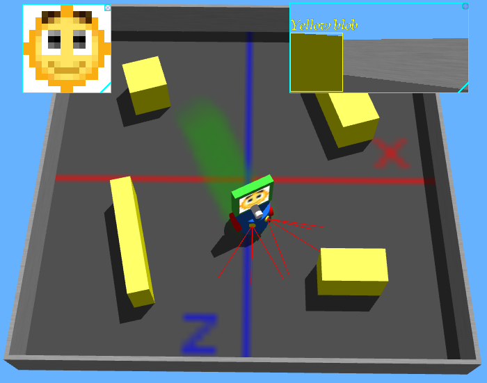 This example demonstrates several use examples of the `Display` device.

- The `MyBot` `Display` called "emoticon_display" is displayed as a 2D overlay on top of the 3D window, and is displayed as a texture on the screen mounted on the `MyBot`.
It loads the `emoticons.png` image contains a grid of emoticons, and shows randomly a different part of this image every 30 steps.
- The `MyBot` `Display` called "camera_display" is displayed as a 2D overlay on top of the 3D window.
It copies the `Camera` image, and draws over it a yellow rectangle and text where yellow pixels are detected.
- The `Supervisor` `Display` called "ground display" is displayed as a texture on the floor.
The `Supervisor` get the position of `MyBot` and draws a green dot at this location.

### distance\_sensor.wbt

**Keywords**: DistanceSensor, Braitenberg

 In this example, `MyBot` has eight `DistanceSensor`s placed at regular intervals around its body.
The robot avoids obstacles using the Braitenberg technique.

### emitter\_receiver.wbt

**Keywords**: Emitter, Receiver, infra-red transmission

 In this example, there are two robots: one is equipped with an `Emitter` and the other one with a `Receiver`.
Both robots move among the obstacles while the *emitter* robot sends messages to the *receiver* robot.
The range of the `Emitter` device is indicated by the radius of the transparent gray sphere around the emitter robot.
The state of the communication between the two robots is displayed in the Console.
You can observe this when the *receiver* robot enters the *emitter*'s sphere while no direct obstacle is present on the route, then the communication is established, otherwise the communication is interrupted.
Note that the communication between "infra-red" `Emitter`s and `Receiver`s can be blocked by an obstacle, this is not the case with "radio" `Emitter`s and `Receiver`s.

### encoders.wbt

**Keywords**: PositionSensor, encoders

 This example demonstrates the usage of the wheel encoders of `differential wheels` robots.
The controller randomly chooses target encoder positions, then it rotates its wheels until the encoder values reach the chosen target position.
Then the encoders are reset and the controller chooses new random values.
The encoders are modelled using `PositionSensor` nodes applied on `HingeJoint` nodes.
The robot does not pay any attention to obstacles.

### force\_sensor.wbt

**Keywords**: TouchSensor, force sensor

 This example is nearly the same as [bumper.wbt](#bumper-wbt).
The only difference is that this robot uses a "force" `TouchSensor` instead of a "bumper".
So this robot can measure the force of each collision, which is printed in the Console window.

### force3d\_sensor.wbt

**Keywords**: TouchSensor, 3D force sensor

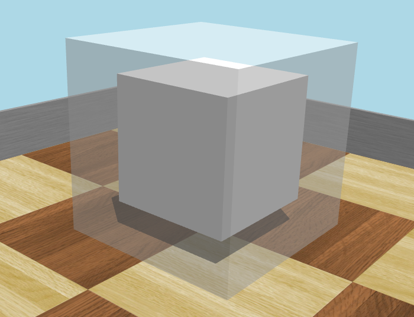 This example demonstrates how to use a 3D force sensor.
The opaque box in the center of the transparent one is a `Robot` node.
The `TouchSensor` is the child of the Robot node.
This setup allow to measure the force on the six sides of the `TouchSensor`.
The resulting force vector is displayed in the console.
Moving and rotating the box will change the displayed force.

### gps.wbt

**Keywords**: GPS, Keyboard, get robot position

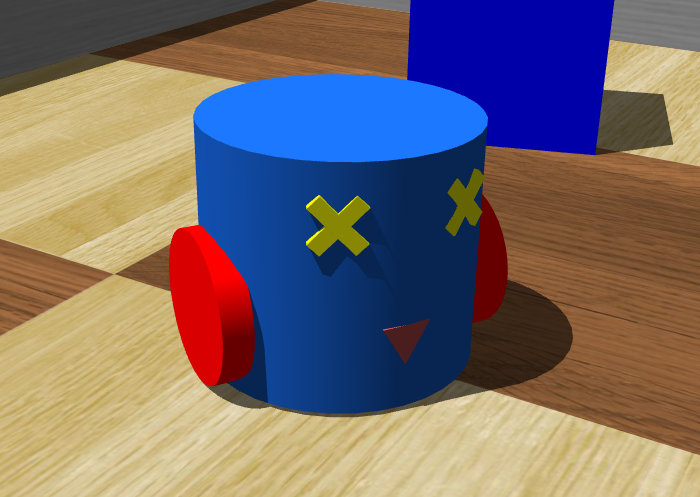 This example shows two different techniques to find the current position of `MyBot`.
The first technique consists in using an on-board `GPS` device.
The second method uses a `Supervisor` controller that reads and transmits the position info to the robot.
Note that a `Supervisor` can read (or change) the position of any object in the simulation at any time.
This example implements both techniques, and you can choose either one or the other with the keyboard.
The `G` key prints the robot's GPS device position.
The `S` key prints the position read by the Supervisor.

### gps_lat_long.wbt

**Keywords**: GPS, WGS84, Latitude-Longitude

 This example shows how to set a WGS84 reference, and how to retrieve the robot WGS84 latitude, longitude and latitude in this reference.
The reference is set in the `WorldInfo.gpsCoordinateSytem` and `WorldInfo.gpsReference`.
The resulting position is displayed in the `Console` at each step.

### gyro.wbt

**Keywords**: Gyro, angular velocity

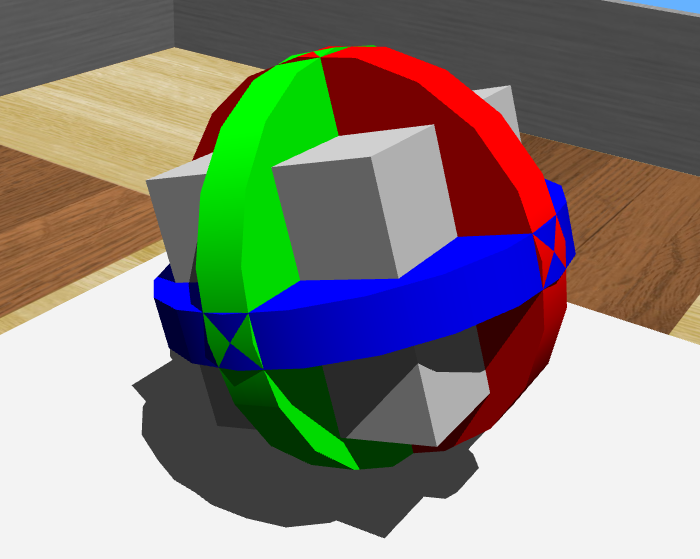 This example shows how to measure an angular velocity.
A gyro is mounted on 3 rotational motors (each motor is corresponding to one axis).
The motors a running consecutively for a while.
The resulting angular velocity measured by the gyro is displayed in the `Console`.

### hokuyo.wbt

**Keywords**: Hokuyo, Lidar, Display plot

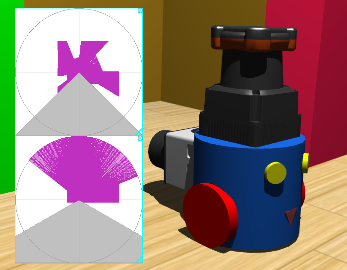 This example shows how to use `Lidar`s and plot their response on a `Display` device.
Two `Hokuyo` `Lidar`s are mounted on the `MyBot`.
At each step, the lidars are updated, and their response are displayed in distinct `Display`s.

### inertial\_unit.wbt

**Keywords**: InertialUnit, roll/pitch/yaw angles

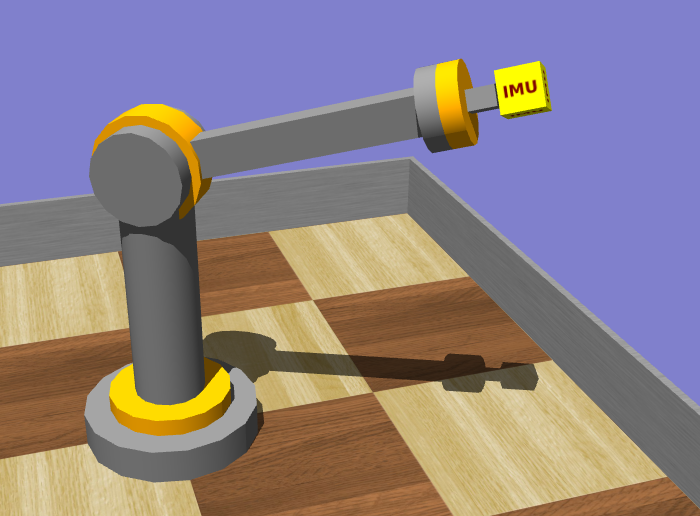 This example demonstrates the use of `InertialUnit` device.
An `InertialUnit` is mounted on a 3 DOF arm which is moving from one random target to another.
Each time a target is reached, the absolute roll, pitch and yaw angles of the `InertialUnit` are displayed in the `Console`.

### laser\_pointer.wbt

**Keywords**: DistanceSensor, laser

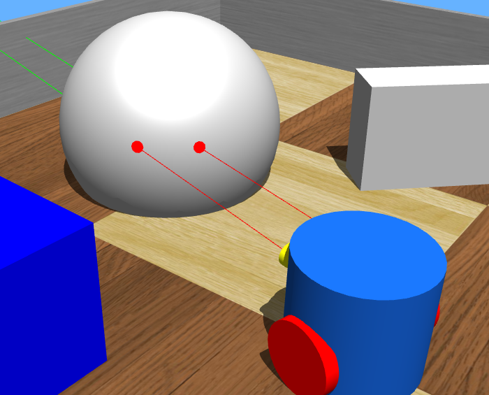 This example demonstrates the use of `DistanceSensor` device in laser mode.
`MyBot` turns round with two laser pointers enabled.
Red dots are displayed where the laser beam is intersecting obstacles.

### led.wbt

**Keywords**: LED

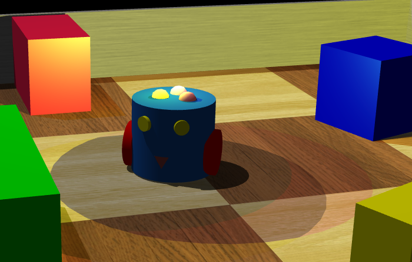 In this example, `MyBot` moves while randomly changing the color of three `LED`s on the top of its body.
Each LED material emissive color and LED mounted `PointLight` are modified accordingly.
The color choice is printed in the Console.

### lidar.wbt

**Keywords**: Lidar

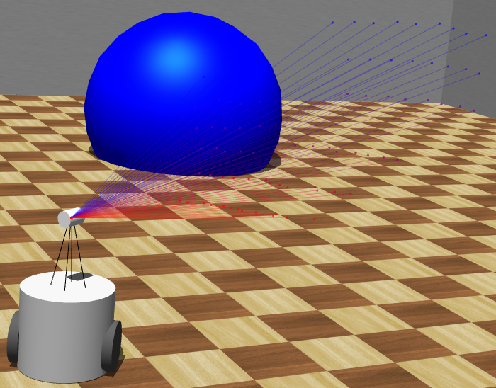 In this example, `MyBot` demonstrates the use of a `Lidar` device.
The `Lidar` mounted on the `MyBot` scans the environment.
The `Lidar` point cloud can be shown enabling the `View / Optional Rendering / Show Lidar Point Cloud`.

### light\_sensor.wbt

**Keywords**: LightSensor

 In this example, `MyBot` uses two `LightSensor`s to follow a light source.
The light source can be moved with the mouse; the robot will follow it.

### pen.wbt

**Keywords**: Pen, keyboard

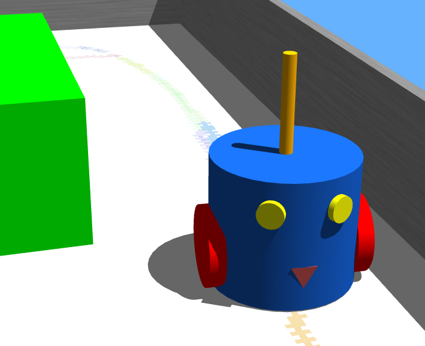 In this example, `MyBot` uses a `Pen` device to draw on the floor.
The controller randomly chooses the ink color.
The ink on the floor fades slowly.
Use the 'Y' and 'X' keys to switch the `Pen` on and off.

### range\_finder.wbt

**Keywords**: Range-finder, Camera

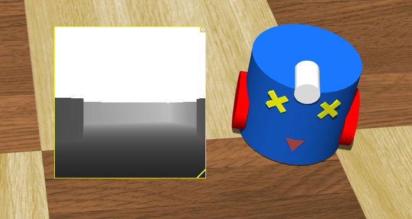 In this example, `MyBot` uses a "range-finder" `Camera` to avoid obstacles.
The "range-finder" measures the distance to objects, so the robot knows if there is enough room to move forward or not.
