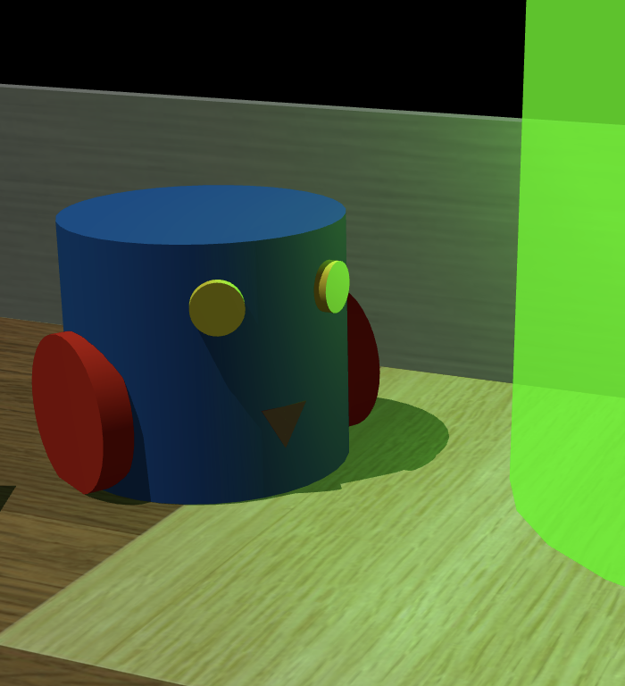
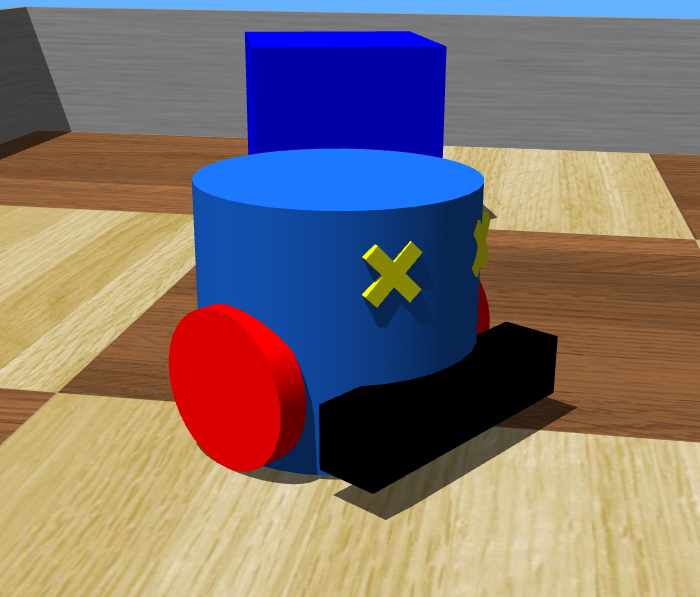
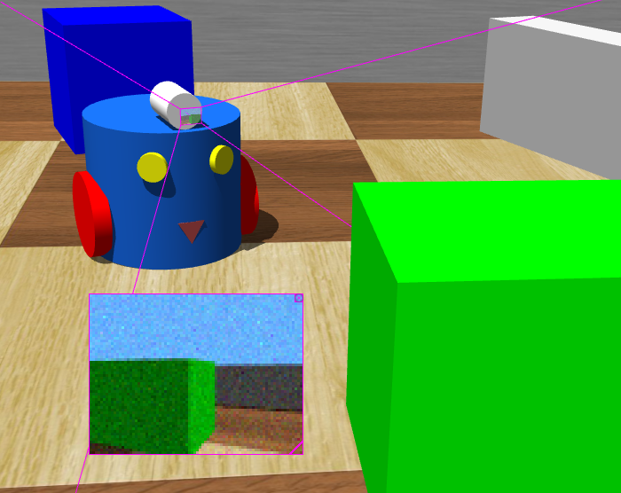
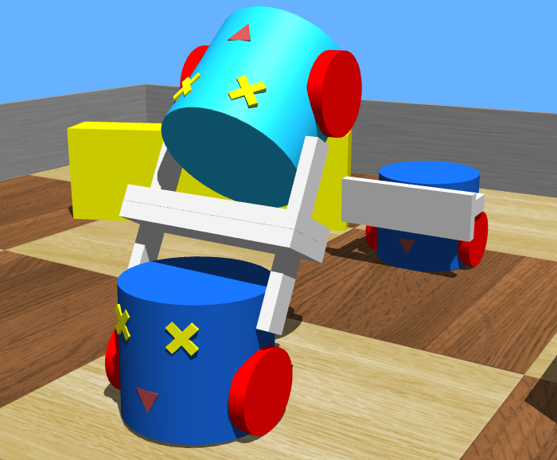
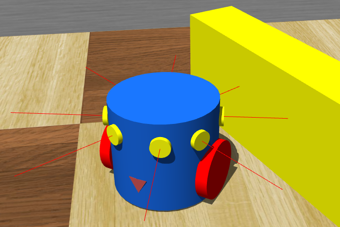
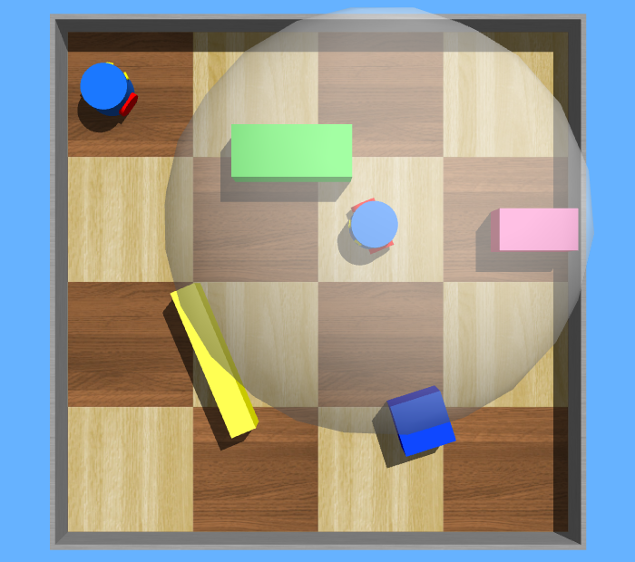
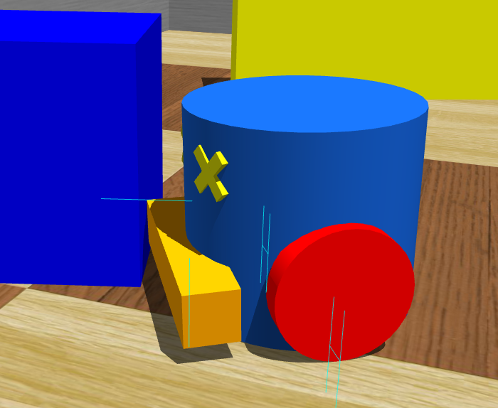
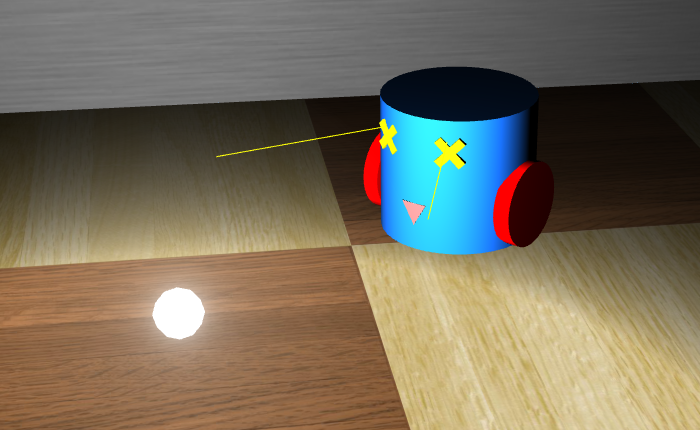

## Webots Devices

The "WEBOTS\_HOME/projects/samples/devices" directory contains Webots applications demonstrating the individual Webots devices and their corresponding API.

The world files are located in the "WEBOTS\_HOME/projects/samples/devices/worlds" directory, and their controllers in the "WEBOTS\_HOME/projects/samples/devices/controllers" directory.
The world files and the corresponding controllers are named according to the device they demonstrate.

Most of the devices below are shown using a simple two-wheeled blue robot called MyBot on a closed square arena containing obstacles (see [figure below](#mybot-in-closed-squared-arena)).
The studied devices are attached on this robot.

%figure "MyBot in closed squared arena."

%end

### battery.wbt

**Keywords**: Battery, Charger

 In this example, myBot moves in a closed arena.
The energy consumed by the wheel motors slowly discharges the robot's battery.
When the battery level reaches zero, the robot is powered off.
In order to remain powered, the robot must recharge its battery at energy chargers.
Chargers are represented by the semi-transparent colored cylinders in the four corners of the arena.
Only a full charger can recharge the robot's battery.
The color of a charger changes with its energy level: it is red when completely empty and green when completely full.

### bumper.wbt

**Keywords**: TouchSensor, bumper

%figure "bumper"

%end

In this example, a robot moves in a closed arena filled with obstacles. Its
"bumper" `TouchSensor` is used to detect collisions. Each time a collision is
detected, the robot moves back and turns a bit.

### camera.wbt

**Keywords**: Camera, image processing, pixel, RGB

%figure "camera"

%end

In this example, a robot uses a camera to detect colored objects. The robot
analyzes the RGB color level of each pixel of the camera images. It turns and
stops for a few seconds when it has detected something. It also prints a message
in the Console explaining the type of object it has detected. You can move the
robot to different parts of the arena (using the mouse) to see what it is able
to detect.

### connector.wbt

**Keywords**: Connector, RotationalMotor, IndexedLineSet

%figure "connector"

%end

In this example, a light robot (light blue) is lifted over two heavier robots
(dark blue). All three robots are equipped with a `Connector` placed at the tip
of a moveable handle (`HingeJoint`). An `IndexedLineSet` is added to every
`Connector` in order to show the axes. When the simulation starts, the light
robot approaches the first heavy robot and their connectors dock to one another.
Then both robots rotate their handles simultaneously, hence the light robot
gets lifted over the heavy one. Then the light robot gets passed over another
time by the second heavy robot and so on ... All the robots in this simulation use
the same controller; the different behaviors are selected according to the
robot's name.

### distance_sensor.wbt

**Keywords**: DistanceSensor, Braitenberg

%figure "distance_sensor"

%end

In this example, a robot has eight `DistanceSensor`s placed at regular intervals
around its body. The robot avoids obstacles using the Braitenberg technique.

### emitter_receiver.wbt

**Keywords**: Emitter, Receiver, infra-red transmission

%figure "emitter_receiver"

%end

In this example, there are two robots: one is equipped with an `Emitter`, the
other one with a `Receiver`. Both robots move among the obstacles while the
*emitter* robot sends messages to the *receiver* robot. The range of the
`Emitter` device is indicated by the radius of the transparent sphere around the
emitter robot. The state of the communication between the two robots is
displayed in the Console. You can observe this when the *receiver* robot enters
the *emitter*'s sphere while no direct obstacle is present on the route, then the communication is established, otherwise the communication is interrupted.
Note that the communication between "infra-red" `Emitter`s and
`Receiver`s can be blocked by an obstacle, this is not the case with "radio"
`Emitter`s and `Receiver`s.

### encoders.wbt

**Keywords**: encoders

%figure "encoders"

%end

This example demonstrates the usage of the wheel encoders of
`differential wheels` robots. The controller randomly chooses target encoder
positions, then it rotates its wheels until the encoder values reach the chosen
target position. Then the encoders are reset and the controller chooses new
random values. The robot does not pay any attention to obstacles.

### force_sensor.wbt

**Keywords**: Force, TouchSensor

%figure "force_sensor"

%end

This example is nearly the same as "bumper.wbt" (see [this
section](#bumper-wbt)). The only difference is that this robot uses a "force"
`TouchSensor` instead of a "bumper". So this robot can measure the force of each
collision, which is printed in the Console window.

### gps.wbt

**Keywords**: GPS, Supervisor, keyboard

%figure "gps"

%end

This example shows two different techniques to find the current position
of a robot. The first technique consists in using an on-board `GPS` device. The
second method uses a `Supervisor` controller that reads and transmits the
position info to the robot. Note that a `Supervisor` can read (or change) the
position of any object in the simulation at any time. This example implements
both techniques, and you can choose either one or the other with the keyboard.
The 'G' key prints the robot's GPS device position. The 'S' key prints the
position read by the Supervisor.

### led.wbt

**Keywords**: LED

%figure "led"

%end

In this example, a robot moves while randomly changing the color of three `LED`s
on the top of its body. The color choice is printed in the Console.

### light_sensor.wbt

%figure "light_sensor"

%end

In this example, the robot uses two `LightSensor`s to follow a light source. The
light source can be moved with the mouse; the robot will follow it.

### pen.wbt

**Keywords**: Pen, keyboard

%figure "pen"

%end

In this example, a robot uses a `Pen` device to draw on the floor. The
controller randomly chooses the ink color. The ink on the floor fades slowly.
Use the 'Y' and 'X' keys to switch the `Pen` on and off.

### range_finder.wbt

**Keywords**: Range-finder, Camera

%figure "range_finder"

%end

In this example, the robot uses a "range-finder" `Camera` to avoid obstacles.
The "range-finder" measures the distance to objects, so the robot knows if there
is enough room to move forward or not.
