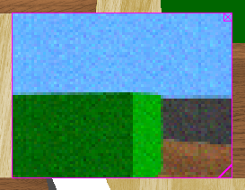

## Camera

Derived from [Device](device.md).

```
Camera {
  SFFloat    fieldOfView      0.7854
  SFInt32    width            64
  SFInt32    height           64
  SFBool     spherical        FALSE
  SFFloat    near             0.01
  SFBool     antiAliasing     FALSE
  SFFloat    motionBlur       0.0
  SFFloat    noise            0.0
  SFString   noiseMaskUrl     ""
  SFNode     lens             NULL
  SFNode     focus            NULL
  SFNode     zoom             NULL
  SFString   compositor       ""
}
```

### Description

The [Camera](#camera) node is used to model a robot's on-board camera. The
resulting image can be displayed on the 3D window. Depending on its setup, the
Camera node can model a linear camera, a typical RGB camera or even a biological
eye which is spherically distorted.

### Field Summary

- `fieldOfView`: horizontal field of view angle of the camera. The value is limited to the range 0 to π radians if the `spherical` field is set to FALSE, otherwise there is no upper limit. Since camera pixels are squares, the vertical field of
view can be computed from the `width`, `height` and horizontal `fieldOfView`:

    *vertical FOV = fieldOfView * height / width*

- `width`: width of the image in pixels

- `height`: height of the image in pixels

- `spherical`: switch between a planar or a spherical projection. A spherical
projection can be used for example to simulate a biological eye. More
information on spherical projection in the corresponding subsection below.

- The `near` field defines the distance from the camera to the near clipping
plane. This plane is parallel to the camera retina (i.e. projection plane). The
near field determines the precision of the OpenGL depth buffer. A too small
value produces depth fighting between overlaid polygons, resulting in random
polygon overlaps. More information on frustums in the corresponding subsection
below.

- The `antiAliasing` field switches on or off (the default) anti-aliasing effect
on the camera images. Anti-aliasing is a technique that assigns pixel colors
based on the fraction of the pixel's area that's covered by the primitives being
rendered. Anti-aliasing makes graphics more smooth and pleasing to the eye by
reducing aliasing artifacts. Aliasing artifacts can appear as jagged edges (or
moiré patterns, strobing, etc.). Anti-aliasing will not be applied if it is not
supported by the hardware.

- If the `motionBlur` field is greater than 0.0, the image is blurred by the
motion of the camera or objects in the field of view. It means the image
returned is a mix between the current view and the previous images returned by
the camera. The value of this field represents the response time of the camera
pixels in milliseconds, which is the amount of time a pixel takes to reach 99.5%
of a new color value (the value of 99.5% was chosen since above this threshold
it is not possible any more to detect color changes with a color component
resolution of 8 bits). Of course smaller the time step is, better the effect is.
Note that this feature is computationally expensive and can considerably reduce
the simulation speed. Furthermore, it is useless to set a value smaller than the
camera time step as it would not have any visible effect.

- If the `noise` field is greater than 0.0, this adds a gaussian noise to each RGB
channel of a color image. A value of 0.0 corresponds to remove the noise and
thus saving computation time. A value of 1.0 corresponds to a gaussian noise
having a standard derivation of 255 in the channel representation. More
information on noise in the corresponding subsection below.

- The `noiseMaskUrl` field specifies the file path of a user-defined noise mask,
usually a transparent PNG image The file should be specified with a relative
path (cf. [this section](imagetexture.md#search-rule-of-the-texture-path)).
Absolute paths work as well, but they are not recommended because they are not
portable across different systems. Ideally, the texture file should lie next to
the world file, possibly inside a "textures" subfolder. It is suggested to use
textures with power of 2 resolution (e.g. 8x8, 2048x64, etc.) and bigger than
the camera resolution to avoid internal scaling that could cause the loss of
pixel precision. The mask is randomly translated during the simulation in order
to produce a flickering noise effect. Thus the bigger the noise texture the
better the randomness quality, because the probabily to see the same patterns
will decrease. Using a noise mask instead of the default gaussian noise reduces
the computation overhead and thus improves the simulation speed. If both types
of noise are enabled, the noise mask is applied before the gaussian noise. This
feature is not available for spherical cameras.

- The `lens` field may contain a [Lens](lens.md) node to specify the image
distortion due to the camera lens.

- The `focus` field may contain a [Focus](focus.md) node to provide the camera
device with a controllable focusing system. If this field is set to NULL, then
no focus is available on the camera device.

- The `zoom` field may contain a [Zoom](zoom.md) node to provide the camera device
with a controllable zoom system. If this field is set to NULL, then no zoom is
available on the camera device.

- The `compositor` field specifies the name of a compositor to apply on the camera
image. A compositor can be used to apply a shader in order to alter the original
image returned by the camera, it runs on the graphic card and can therefore be
very fast. Compositor is a technique provided by Ogre3d, you should respect the
syntax defined by Ogre3d. Have a look at the [Ogre3d
documentation](http://www.ogre3d.org/docs/manual/manual_29.html) for more
information about compositors. Such a compositor can for example be used to
simulate camera imperfections (e.g., lens distorion) or to run image processing
directly on the graphic card (e.g., edge detection). Note that the compositor is
applied at the end (i.e., after the addition of noise, etc.). The compositor
resource files (compositor, material, shader, texture, etc.) should be located
in a directory called `compositors` close to the world file. If the camera is
contained in a PROTO file then the compositor files should be located in a
directory called `compositors` close to the PROTO file. The internal compositor
resource files of Webots can be used in any compositor, they are located in
"WEBOTS\_HOME/resources/ogre". Compositors can be added/removed at any time,
even while the simulation is running. However, the compositor resource files are
loaded at the same time as the world file. Therefore any modification to the
compositor files will need a revert of the simulation to be taken into account.

### Camera image

The camera device computes OpenGL rendered images. The pixel information can be
obtained from the `wb_camera_get_image` function. The red, green and blue
channels (RGB) can be extracted from the resulting image by the
`wb_camera_image_get_*`-like functions.

Each time a camera is refreshed, an OpenGL rendering is performed, and the color
information is copied into the buffer returned by the `wb_camera_get_image`
function. The format of this buffers is BGRA (32 bits). We recommend to use the
`wb_camera_image_get_*`-like functions to access the buffer because the internal
format could change.

> **note** [Matlab]:
The Matlab API uses a language-specific representation of color images
consisting of a 3D array of RGB triplets. Please look at the [Matlab
example](#wb_camera_get_image) in the `wb_camera_get_image` function's
description.

### Frustum

The frustum is the truncated pyramid defining what is visible from the camera.
Any 3D shape completely outside this frustum won't be rendered. Hence, shapes
located too close to the camera (standing between the camera and the near plane)
won't appear. It can be displayed with magenta lines by enabling the
`View|Optional Rendering|Show Camera Frustums` menu item. The `near` field
defines the position of the near clipping plane (x, y, -near). The `fieldOfView`
field defines the horizontal angle of the frustum. The `fieldOfView`, `width`
and `height` fields define the vertical angle of the frustum according to the
above formula.

Generally speaking there is no far clipping plane while this is common in other
OpenGL programs. In Webots, a camera can see as far as needed.

In the case of the spherical cameras, the frustum is quite different and
difficult to represent. In comparison with the frustum description above, the
near and the far planes are transformed to be sphere parts having their center
at the camera position, and the `fieldOfView` can be greater than Pi.

### Noise

It is possible to add quickly a white noise on the cameras by using the `noise`
field. A value of `0.0` corresponds to an image without noise. For each channel
of the image and at each camera refresh, a gaussian noise is computed and added
to the channel. This gaussian noise has a standard deviation corresponding to
the noise field times the channel range. The channel range is 256 for a color
camera.

### Spherical projection

OpenGL is designed to have only planar projections. However spherical
projections are very useful for simulating a camera pointing on a curved mirror
or a biological eye. Therefore we implemented a camera mode rendering spherical
projections. It can be enabled simply by switching on the corresponding
`spherical` field described above.

Internally, depending on the field of view, a spherical camera is implemented by
using between 1 to 6 OpenGL cameras oriented towards the faces of a cube (the
activated cameras are displayed by magenta squares when the `View|Optional
Rendering|Show Camera Frustums` menu item is enabled). Moreover an algorithm
computing the spherical projection is applied on the result of the subcameras.

So this mode is costly in terms of performance! Reducing the resolution of the
cameras and using a `fieldOfView` which minimizes the number of activated
cameras helps a lot to improve the performance if needed.

When the camera is spherical, the image returned by the `wb_camera_get_image`
function is a 2-dimensional array (s,t) in spherical coordinates.

Let `hFov` be the horizontal field of view, and let `theta` be the angle in
radian between the `(0, 0, -z)` relative coordinate and the relative coordinate
of the target position along the `xz` plane relative to the camera, then `s=0`
corresponds to a `theta` angle of `-hFov/2`, `s=(width-1)/2` corresponds to a
`theta` angle of 0, and `s=width-1` corresponds to a `theta` angle of `hFov/2`.

Similarly, let `vFov` be the vertical field of view (defined just above), and
`phi` the angle in radian between the `(0, 0, -z)` relative coordinate and the
relative coordinate of the target position along the `xy` plane relative to the
camera, `t=0` corresponds to a `phi` angle of `-vFov/2`, `t=(height-1)/2`
corresponds to a `phi` angle of 0, and `t=height-1` corresponds to a `phi` angle
of `vFov/2`).

### Overlay Image

%figure "Camera overlay image"



%end

The camera image is shown by default on top of the 3D window with a magenta
border, see [this figure](#camera-overlay-image). The user can move this camera
image at the desired position using the mouse drag and drop and resize it by
clicking on the icon at the bottom right corner. Additionally a close button is
available on the top right corner to hide the image. Once the robot is selected,
it is also possible to show or hide the overlay images from the `Camera Devices`
item in `Robot` menu.

It is also possible to show the camera image in an external window by
double-clicking on it. After doing it, the overlay disappears and a new window
pops up. Then, after closing the window, the overlay will be automatically
restored.

### Camera Functions

**Name**

**wb\_camera\_enable**, **wb\_camera\_disable**, **wb\_camera\_get\_sampling\_period** - *enable and disable camera updates*

{[C++](cpp-api.md#cpp_camera)}, {[Java](java-api.md#java_camera)}, {[Python](python-api.md#python_camera)}, {[Matlab](matlab-api.md#matlab_camera)}, {[ROS](ros-api.md)}

``` c
#include <webots/camera.h>

void wb_camera_enable(WbDeviceTag tag, int ms)
void wb_camera_disable(WbDeviceTag tag)
int wb_camera_get_sampling_period(WbDeviceTag tag)
```

**Description**

`wb_camera_enable()` allows the user to enable a camera update each `ms`
milliseconds.
The provided `ms` argument specifies the sensor's sampling period.
Note that the first measurement will be available only after the first sampling period elapsed.

`wb_camera_disable()` turns the camera off, saving computation time.

The `wb_camera_get_sampling_period()` function returns the period given into the
`wb_camera_enable()` function, or 0 if the device is disabled.

---

**Name**

**wb\_camera\_get\_fov**, **wb\_camera\_get\_min\_fov**, **wb\_camera\_get\_max\_fov**, **wb\_camera\_set\_fov** - *get and set field of view for a camera*

{[C++](cpp-api.md#cpp_camera)}, {[Java](java-api.md#java_camera)}, {[Python](python-api.md#python_camera)}, {[Matlab](matlab-api.md#matlab_camera)}, {[ROS](ros-api.md)}

``` c
#include <webots/camera.h>

double wb_camera_get_fov(WbDeviceTag tag)
double wb_camera_get_min_fov(WbDeviceTag tag)
double wb_camera_get_max_fov(WbDeviceTag tag)
void wb_camera_set_fov(WbDeviceTag tag, double fov)
```

**Description**

These functions allow the controller to get and set the value for the field of
view (fov) of a camera. The original value for this field of view is defined in
the [Camera](#camera) node, as `fieldOfView`. Note that changing the field of
view using `wb_camera_set_fov()` is possible only if the camera device has a
[Zoom](zoom.md) node defined in its `zoom` field. The minimum and maximum values
for the field of view are defined in this [Zoom](zoom.md) node, if the zoom is
not defined, then the functions `wb_camera_get_min_fov()` and
`wb_camera_get_max_fov()` will return the camera's field of view.

---

**Name**

**wb\_camera\_get\_focal\_length**, **wb\_camera\_get\_focal\_distance**, **wb\_camera\_get\_max\_focal\_distance**, **wb\_camera\_get\_min\_focal\_distance**, **wb\_camera\_set\_focal\_distance** - *get and set the focusing parmaters*

{[C++](cpp-api.md#cpp_camera)}, {[Java](java-api.md#java_camera)}, {[Python](python-api.md#python_camera)}, {[Matlab](matlab-api.md#matlab_camera)}, {[ROS](ros-api.md)}

``` c
#include <webots/camera.h>

double wb_camera_get_focal_length(WbDeviceTag tag)
double wb_camera_get_focal_distance(WbDeviceTag tag)
double wb_camera_get_max_focal_distance(WbDeviceTag tag)
double wb_camera_get_min_focal_distance(WbDeviceTag tag)
void wb_camera_set_focal_distance(WbDeviceTag tag, double focal_distance)
```

**Description**

These functions allow the controller to get and set the focusing parameters.
Note that if the camera device has no [Focus](focus.md) node defined in its
`focus` field, it is not possible to call `wb_camera_set_focal_distance()` and
the other functions will return 0.

---

**Name**

**wb\_camera\_get\_width**, **wb\_camera\_get\_height** - *get the size of the camera image*

{[C++](cpp-api.md#cpp_camera)}, {[Java](java-api.md#java_camera)}, {[Python](python-api.md#python_camera)}, {[Matlab](matlab-api.md#matlab_camera)}, {[ROS](ros-api.md)}

``` c
#include <webots/camera.h>

int wb_camera_get_width(WbDeviceTag tag)
int wb_camera_get_height(WbDeviceTag tag)
```

**Description**

These functions return the width and height of a camera image as defined in the
corresponding [Camera](#camera) node.

---

**Name**

**wb\_camera\_get\_near** - *get the near parameter of the camera device*

{[C++](cpp-api.md#cpp_camera)}, {[Java](java-api.md#java_camera)}, {[Python](python-api.md#python_camera)}, {[Matlab](matlab-api.md#matlab_camera)}, {[ROS](ros-api.md)}

``` c
#include <webots/camera.h>

double wb_camera_get_near(WbDeviceTag tag)
```

**Description**

This function returns the near parameter of a camera device as defined in the
corresponding [Camera](#camera) node.

---

**Name**

**wb\_camera\_get\_image**, **wb\_camera\_image\_get\_red**, **wb\_camera\_image\_get\_green**, **wb\_camera\_image\_get\_blue**, **wb\_camera\_image\_get\_gray** - *get the image data from a camera*

{[C++](cpp-api.md#cpp_camera)}, {[Java](java-api.md#java_camera)}, {[Python](python-api.md#python_camera)}, {[Matlab](matlab-api.md#matlab_camera)}, {[ROS](ros-api.md)}

``` c
#include <webots/camera.h>

const unsigned char *wb_camera_get_image(WbDeviceTag tag)
unsigned char wb_camera_image_get_red(const unsigned char *image, int width, int x, int y)
unsigned char wb_camera_image_get_green(const unsigned char *image, int width, int x, int y)
unsigned char wb_camera_image_get_blue(const unsigned char *image, int width, int x, int y)
unsigned char wb_camera_image_get_gray(const unsigned char *image, int width, int x, int y)
```

**Description**

The `wb_camera_get_image()` function reads the last image grabbed by the camera.
The image is coded as a sequence of three bytes representing the red, green and
blue levels of a pixel. Pixels are stored in horizontal lines ranging from the
top left hand side of the image down to bottom right hand side. The memory chunk
returned by this function must not be freed, as it is handled by the camera
itself. The size in bytes of this memory chunk can be computed as follows:

`byte_size` = `camera_width` * `camera_height` * 4

Internal pixel format of the buffer is BGRA (32 bits). Attempting to read
outside the bounds of this chunk will cause an error.

The `wb_camera_image_get_red(), wb_camera_image_get_green()` and
`wb_camera_image_get_blue()` macros can be used for directly accessing the pixel
RGB levels from the pixel coordinates. The `wb_camera_image_get_gray()` macro
works in a similar way but returns the gray level of the specified pixel by
averaging the three RGB components. In the C version, these four macros return
an `unsigned char` in the range [0..255]. Here is a C usage example:

```c
const unsigned char *image = wb_camera_get_image(camera);
for (int x = 0; x < image_width; x++)
  for (int y = 0; y < image_height; y++) {
    int r = wb_camera_image_get_red(image, image_width, x, y);
    int g = wb_camera_image_get_green(image, image_width, x, y);
    int b = wb_camera_image_get_blue(image, image_width, x, y);
    printf("red=%d, green=%d, blue=%d", r, g, b);
  }
```

> **note** [Java]:
`Camera.getImage()` returns an array of int (`int[]`). The length of this array
corresponds to the number of pixels in the image, that is the width multiplied
by the height of the image. Each `int` element of the array represents one pixel
coded in BGRA (32 bits). For example red is `0x0000ff00`, green is `0x00ff0000`,
etc. The `Camera.pixelGetRed(), Camera.pixelGetGreen()` and
`Camera.pixelGetBlue()` functions can be used to decode a pixel value for the
red, green and blue components. The `Camera.pixelGetGray()` function works in a
similar way, but returns the gray level of the pixel by averaging the three RGB
components. Each of these four functions take an `int` pixel argument and return
an `int` color/gray component in the range [0..255]. Here is an example:

>     int[] image = camera.getImage();
>     for (int i=0; i < image.length; i++) {
>       int pixel = image[i];
>       int r = Camera.pixelGetRed(pixel);
>       int g = Camera.pixelGetGreen(pixel);
>       int b = Camera.pixelGetBlue(pixel);
>       System.out.println("red=" + r + " green=" + g + " blue=" + b);
>     }

<!-- -->

> **note** [Python]:
`getImage()` returns a `string`. This `string` is closely related to the `const
char *` of the C API. `imageGet*`-like functions can be used to get the channels
of the camera Here is an example:

>     #...
>     cameraData = camera.getImage()
>
>     # get the gray component of the pixel (5,10)
>     gray = Camera.imageGetGray(cameraData, camera.getWidth(), 5, 10)

> Another way to use the camera in Python is to get the image by `getImageArray()`
which returns a `list<list<list<int>>>`. This three dimensional list can be
directly used for accessing to the pixels. Here is an example:

>     image = camera.getImageArray()
>     # display the components of each pixel
>     for x in range(0,camera.getWidth()):
>       for y in range(0,camera.getHeight()):
>         red   = image[x][y][0]
>         green = image[x][y][1]
>         blue  = image[x][y][2]
>         gray  = (red + green + blue) / 3
>         print 'r='+str(red)+' g='+str(green)+' b='+str(blue)

<!-- -->

> **note** [Matlab]:
`wb_camera_get_image()` returns a 3-dimensional array of `uint(8)`. The first
two dimensions of the array are the width and the height of camera's image, the
third being the RGB code: 1 for red, 2 for blue and 3 for green.
`wb_camera_get_range_image()` returns a 2-dimensional array of
`float('single')`. The dimensions of the array are the width and the length of
camera's image and the float values are the metric distance values deduced from
the OpenGL z-buffer.

>     camera = wb_robot_get_device('camera');
>     wb_camera_enable(camera,TIME_STEP);
>     half_width = floor(wb_camera_get_width(camera) / 2);
>     half_height = floor(wb_camera_get_height(camera) / 2);
>     % color camera image
>     image = wb_camera_get_image(camera);
>     red_middle_point = image(half_width,half_heigth,1);% red color component of the pixel lying in the middle of the image
>     green_middle_line = sum(image(half_width,:,2));% sum of the green color over the vertical middle line of the image
>     blue_overall = sum(sum(image(:,:,3));% sum of the blue color over all the pixels in the image
>     fprintf('red_middle_point = %d, green_middle_line = %d, blue_overall = %d\n', red_middle_point, green_middle_line, blue_overall);
>     % range-finder camera image
>     image = wb_camera_get_range_image(camera);
>     imagesc(image,[0 1]);
>     colormap(gray);
>     drawnow;
>     distance = min(min(image))% distance to the closest point seen by the camera

---

**Name**

**wb\_camera\_save\_image** - *save a camera image in either PNG or JPEG format*

{[C++](cpp-api.md#cpp_camera)}, {[Java](java-api.md#java_camera)}, {[Python](python-api.md#python_camera)}, {[Matlab](matlab-api.md#matlab_camera)}, {[ROS](ros-api.md)}

``` c
#include <webots/camera.h>

int wb_camera_save_image(WbDeviceTag tag, const char *filename, int quality)
```

**Description**

The `wb_camera_save_image()` function allows the user to save a `tag` image
which was previously obtained with the `wb_camera_get_image()` function. The
image is saved in a file in either PNG or JPEG format. The image format is
specified by the `filename` parameter. If `filename` is terminated by `.png`,
the image format is PNG. If `filename` is terminated by `.jpg` or `.jpeg`, the
image format is JPEG. Other image formats are not supported. The `quality`
parameter is useful only for JPEG images. It defines the JPEG quality of the
saved image. The `quality` parameter should be in the range 1 (worst quality) to
100 (best quality). Low quality JPEG files will use less disk space. For PNG
images, the `quality` parameter is ignored.

The return value of the `wb_camera_save_image()` is 0 in case of success. It is
-1 in case of failure (unable to open the specified file or unrecognized image
file extension).
