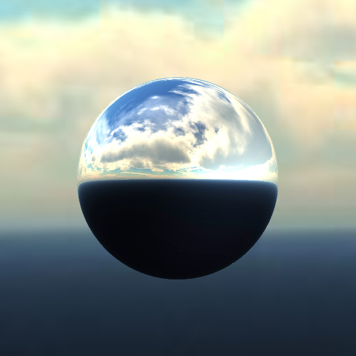

## ComposedCubeMapTexture

```
ComposedCubeMapTexture {
  vrmlField SFNode right   NULL
  vrmlField SFNode left    NULL
  vrmlField SFNode top     NULL
  vrmlField SFNode bottom  NULL
  vrmlField SFNode front   NULL
  vrmlField SFNode back    NULL
}
```

### Description

The [ComposedCubeMapTexture](#composedcubemaptexture) node defines a cubic texture used for environment mapping. It is composed of exactly six [ImageTexture](imagetexture.md) nodes, matching the six faces of a virtual cube. If one of the [ImageTexture](imagetexture.md)s is not set, the corresponding side of the cubic texture will be black.

Each of the six fields takes a texture corresponding to the side of the surrounding environment. For instance `right` takes the texture displayed on the side of the cube along the +X direction. Accordingly we have the following order: right: +X, left: -X, top: +Y, bottom: -Y, front: +Z, back: -Z.

The [ComposedCubeMapTexture](#composedcubemaptexture) is typically used together with a [ComposedShader](composedshader.md), as the following example demonstrates. In the fragment shader the cubic texture can be queried through a `uniform samplerCube` using the OpenGL function `vec4 textureCube (samplerCube sampler, vec3 coord [, float bias] )`.

### Example

The following is an example of an environment mapping shader:

```
Shape {
  appearance Appearance {
    material Material {
    }
    texture ComposedCubeMapTexture {
      right ImageTexture {
        url [
          "textures/noon_cloudy_empty_right.jpg"
        ]
      }
      left ImageTexture {
        url [
          "textures/noon_cloudy_empty_left.jpg"
        ]
      }
      top ImageTexture {
        url [
          "textures/noon_cloudy_empty_top.jpg"
        ]
      }
      bottom ImageTexture {
        url [
          "textures/noon_cloudy_empty_bottom.jpg"
        ]
      }
      front ImageTexture {
        url [
          "textures/noon_cloudy_empty_front.jpg"
        ]
      }
      back ImageTexture {
        url [
          "textures/noon_cloudy_empty_back.jpg"
        ]
      }
    }
    shaders [
      ComposedShader {
        uniforms [
          Uniform {
            name "texCube"
            type "SFInt32"
            value "0"
          }
        ]
        parts [
          ShaderPart {
            type "VERTEX"
            content [
              "#version 120"
              ""
              "uniform mat4 worldMatrix;"
              "uniform mat4 viewMatrixInverse;"
              ""
              "varying vec3 N;"
              "varying vec3 E;"
              ""
              "void main() {"
              "  E = (worldMatrix * gl_Vertex).xyz - viewMatrixInverse[3].xyz;"
              "  N = (worldMatrix * vec4(gl_Normal, 0.0)).xyz;"
              "  gl_Position = ftransform();"
              "}"
            ]
          }
          ShaderPart {
            type "FRAGMENT"
            content [
              "#version 120"
              ""
              "uniform samplerCube texCube;"
              ""
              "varying vec3 N;"
              "varying vec3 E;"
              ""
              "void main() {"
              "  vec3 eye = normalize(E);"
              "  vec3 n = normalize(N);"
              ""
              "  vec3 cubeCoord = reflect(eye, n);"
              ""
              "  gl_FragColor = vec4(textureCube(texCube, cubeCoord).rgb, 1.0);"
              "}"
            ]
          }
        ]
      }
    ]
  }
  geometry Sphere {
    subdivision 4
  }
}
```

Which results in the following textured Sphere:

%figure "Environment Mapped Sphere"



%end
