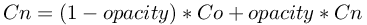

## Display

Derived from [Device](device.md#device).

```
Display {
  SFInt32    width          64
  SFInt32    height         64
}
```

### Description

The [Display](#display) node allows to handle a 2D pixel array using simple API
functions, and render it into a 2D overlay on the 3D view, into a 2D texture of
any [Shape](shape.md#shape) node, or both. It can model an embedded screen or it
can display any graphical information such as graphs, text, robot trajectory,
filtered camera images and so on.

If the first child of the [Display](#display) node is or contains (recursive
search if the first node is a [Group](group.md#group)) a [Shape](shape.md#shape)
node having a [ImageTexture](imagetexture.md#imagetexture), then the internal
texture of the(se) [ImageTexture](imagetexture.md#imagetexture) node(s) is
replaced by the texture of the [Display](#display).

### Field Summary

- `width`: width of the display in pixels
- `height`: height of the display in pixels

### Coordinates system

Internally, the [Display](#display) image is stored in a 2D pixel array. The
RGBA value (4x8 bits) of a pixel is dislayed in the status bar (the bar at the
bottom of the console window) when the mouse hovers over the pixel in the
[Display](#display). The 2D array has a fixed size defined by the `width` and
`height` fields. The (0,0) coordinate corresponds to the top left pixel, while
the (`width`-1,`height`-1) coordinate corresponds to the bottom right pixel.

### Command stack

Each function call of the [Display](#display) device API (except for
`wb_display_get_width()` and `wb_display_get_height()`) is storing a specific
command into an internal stack. This command stack is sent to Webots during the
next call of the `wb_robot_step()` function, using a FIFO scheme (First In,
First Out), so that commands are executed in the same order as the corresponding
function calls.

### Context

The [Display](#display) device has among other things two kinds of functions;
the contextual ones which allow to set the current state of the display, and the
drawing ones which allow to draw specific primitives. The behavior of the
drawing functions depends on the display context. For example, in order to draw
two red lines, the `wb_display_set_color` contextual function must be called for
setting the display's internal color to red before calling twice the
`wb_display_draw_line` drawing function to draw the two lines.

### Overlay Image

%figure "Display overlay image"


%end

The display image is shown by default on top of the 3D window with a cyan
border, see [this figure](#display-overlay-image). The user can move this
display image at the desired position using the mouse drag and drop and resize
it by clicking on the icon at the bottom right corner. Additionally a close
button is available on the top right corner to hide the image. Once the robot is
selected, it is also possible to show or hide the overlay image from the
`Display Devices` item in `Robot` menu.

It is also possible to show the display image in an external window by
double-clicking on it. After doing it, the overlay disappears and the new window
pops up. Then, after closing the window, the overlay will be automatically
restored.

### Display Functions

**Name** <a name="wb_display_get_width"/>

**wb\_display\_get\_width**, **wb\_display\_get\_height** - *get the size of the display*

{[C++](cpp-api.md#cpp_display)}, {[Java](java-api.md#java_display)}, {[Python](python-api.md#python_display)}, {[Matlab](matlab-api.md#matlab_display)}

``` c
#include <webots/display.h>

int wb_display_get_width(WbDeviceTag tag)
int wb_display_get_height(WbDeviceTag tag)
```

**Description**

These functions return respectively the values of the `width` and `height`
fields.

---

**Name** <a name="wb_display_set_context"/>

**wb\_display\_set\_color**, **wb\_display\_set\_alpha**, **wb\_display\_set\_opacity** - *set the drawing properties of the display*

{[C++](cpp-api.md#cpp_display)}, {[Java](java-api.md#java_display)}, {[Python](python-api.md#python_display)}, {[Matlab](matlab-api.md#matlab_display)}

``` c
#include <webots/display.h>

void wb_display_set_color(WbDeviceTag tag, int color)
void wb_display_set_alpha(WbDeviceTag tag, double alpha)
void wb_display_set_opacity(WbDeviceTag tag, double opacity)
```

**Description**

These three functions define the context in which the subsequent drawing
commands (see [draw primitive functions](#wb_display_draw_primitive)) will be
applied.

`wb_display_set_color()` defines the color for the subsequent drawing commands.
It is expressed as a 3 bytes RGB integer, the most significant byte (leftmost
byte in hexadecimal representation) represents the red component, the second
most significant byte represents the green component and the third byte
represents the blue component. For example, `0xFF00FF` (a mix of the red and
blue components) represents the magenta color. Before the first call to
`wb_display_set_color()`, the default color is white (`0xFFFFFF`).

`wb_display_set_alpha()` defines the alpha channel for the subsequent drawing
commands. This function should be used only with special displays that can be
transparent or semi-transparent (for which one can see through the display). The
alpha channel defines the opacity of a pixel of the display. It is expressed as
a floating point value between 0.0 and 1.0 representing respectively fully
transparent and fully opaque. Intermediate values correspond to semi-transparent
levels. Before the first call to `wb_display_set_alpha()`, the default value for
alpha is 1 (opaque).

`wb_display_set_opacity()` defines with which opacity the new pixels will
replace the old ones for the following drawing instructions. It is expressed as
a floating point value between 0.0 and 1.0; while 0 means that the new pixel has
no effect over the old one and 1 means that the new pixel replaces entirely the
old one. Only the color channel is affected by the `opacity` according to the
[figure](#blending-formula-used-to-compute-the-new-the-color-channels-cn-of-a-pixel-from-the-old-color-channels-co-of-the-background-pixel-and-from-the-opacity)
formula.

%figure "Blending formula used to compute the new the color channels (Cn) of a pixel from the old color channels (Co) of the background pixel and from the opacity."



%end

> **note** [Matlab]:
In the Matlab version of `wb_display_set_color()` the `color` argument must be a
vector containing the three RGB components: `[RED GREEN BLUE]`. Each component
must be a value between 0.0 and 1.0. For example the vector `[1 0 1]` represents
the magenta color.

---

**Name** <a name="wb_display_draw_primitive"/>

**wb\_display\_draw\_pixel**, **wb\_display\_draw\_line**, **wb\_display\_draw\_rectangle**, **wb\_display\_draw\_oval**, **wb\_display\_draw\_polygon**, **wb\_display\_draw\_text**, **wb\_display\_fill\_rectangle**, **wb\_display\_fill\_oval**, **wb\_display\_fill\_polygon** - *draw a graphic primitive on the display*

{[C++](cpp-api.md#cpp_display)}, {[Java](java-api.md#java_display)}, {[Python](python-api.md#python_display)}, {[Matlab](matlab-api.md#matlab_display)}

``` c
#include <webots/display.h>

void wb_display_draw_pixel(WbDeviceTag tag, int x, int y)
void wb_display_draw_line(WbDeviceTag tag, int x1, int y1, int x2, int y2)
void wb_display_draw_rectangle(WbDeviceTag tag, int x, int y, int width, int height)
void wb_display_draw_oval(WbDeviceTag tag, int cx, int cy, int a, int b)
void wb_display_draw_polygon(WbDeviceTag tag, const int *x, const int *y, int size)
void wb_display_draw_text(WbDeviceTag tag, const char *txt, int x, int y)
void wb_display_fill_rectangle(WbDeviceTag tag, int x, int y, int width, int height)
void wb_display_fill_oval(WbDeviceTag tag, int cx, int cy, int a, int b)
void wb_display_fill_polygon(WbDeviceTag tag, const int *x, const int *y, int size)
```

**Description**

These functions order the execution of a drawing primitive on the display. They
depend on the context of the display as defined by the contextual functions (see
[set context functions](#wb_display_set_context)).

`wb_display_draw_pixel()` draws a pixel at the (`x`,`y`) coordinate.

`wb_display_draw_line()` draws a line between the (`x1`,`y1`) and the
(`x2`,`y2`) coordinates using the *Bresenham's line drawing algorithm*.

`wb_display_draw_rectangle()` draws the outline of a rectangle having a size of
`width`*`height`. Its top left pixel is defined by the (`x`,`y`) coordinate.

`wb_display_draw_oval()` draws the outline of an oval. The center of the oval is
specified by the (`cx`,`cy`) coordinate. The horizontal and vertical radius of
the oval are specified by the (`a`,`b`) parameters. If `a` equals `b`, this
function draws a circle.

`wb_display_draw_polygon()` draws the outline of a polygon having `size`
vertices. The list of vertices must be defined into `px` and `py`. If the first
pixel coordinates are not identical to the last ones, the loop is automatically
closed. Here is an example :

```

  const int px[] = {10,20,10, 0};
  const int py[] = {0, 10,20,10};
  wb_display_draw_polygon(display,px,py,4); // draw a diamond
```

`wb_display_draw_text()` draws an ASCII text from the (`x`,`y`) coordinate. The
font used to display the characters has a size of 8x8 pixels. There is no extra
space between characters.

`wb_display_fill_rectangle()` draws a rectangle having the same properties as
the rectangle drawn by the `wb_display_draw_rectangle()` function except that it
is filled instead of outlined.

`wb_display_fill_oval()` draws an oval having the same properties as the oval
drawn by the `wb_display_draw_oval()` function except that it is filled instead
of outlined.

`wb_display_fill_polygon()` draws a polygon having the same properties as the
polygon drawn by the `wb_display_draw_polygon()` function except that it is
filled instead of outlined.

> **note** [Java, Python, Matlab]:
The Java, Python and Matlab equivalent of `wb_display_draw_polygon()` and
`wb_display_fill_polygon()` don't have a `size` argument because in these
languages the size is determined directly from the `x` and `y` arguments.

---

**Name** <a name="wb_display_image_functions"/>

**wb\_display\_image\_new**, **wb\_display\_image\_load**, **wb\_display\_image\_copy**, **wb\_display\_image\_paste**, **wb\_display\_image\_save**, **wb\_display\_image\_delete** - *image manipulation functions*

{[C++](cpp-api.md#cpp_display)}, {[Java](java-api.md#java_display)}, {[Python](python-api.md#python_display)}, {[Matlab](matlab-api.md#matlab_display)}

``` c
#include <webots/display.h>

WbImageRef wb_display_image_new(WbDeviceTag tag, int width, int height, const void *data, int format)
WbImageRef wb_display_image_load(WbDeviceTag tag, const char *filename)
WbImageRef wb_display_image_copy(WbDeviceTag tag, int x, int y, int width, int height)
void wb_display_image_paste(WbDeviceTag tag, WbImageRef ir, int x, int y)
void wb_display_image_save(WbDeviceTag tag, WbImageRef ir, const char *filename)
void wb_display_image_delete(WbDeviceTag tag, WbImageRef ir)
```

**Description**

In addition to the main display image, each [Display](#display) node also
contains a list of clipboard images used for various image manipulations. This
list is initially empty. The functions described below use a reference
(corresponding to the `WbImageRef` data type) to refer to a specific image.
Clipboard images can be created either with `wb_display_image_new()`, or
`wb_display_image_load()`, or `wb_display_image_copy()`. They should be deleted
with the `wb_display_image_delete()` function.when they are no more used.
Finally, note that both the main display image and the clipboard images have an
alpha channel.

`wb_display_image_new()` creates a new clipboard image, with the specified
`with` and `height`, and loads the image `data` into it with respect to the
defined image `format`. Three images format are supported: `WB_IMAGE_RGBA` which
is similar to the image format returned by a `Camera` device and `WB_IMAGE_RGB`
or `WB_IMAGE_ARGB`. `WB_IMAGE_RGBA` and `WB_IMAGE_ARGB` are including an alpha
channel respectively after and before the color components.

`wb_display_image_load()` creates a new clipboard image, loads an image file
into it and returns a reference to the new clipboard image. The image file is
specified with the `filename` parameter (relatively to the controller
directory). An image file can be in either PNG or JPEG format. Note that this
function involves sending an image from the controller process to Webots, thus
possibly affecting the overall simulation speed.

`wb_display_image_copy()` creates a new clipboard image and copies the specified
sub-image from the main display image to the new clipboard image. It returns a
reference to the new clipboard image containing the copied sub-image. The copied
sub-image is defined by its top left coordinate (`x`,`y`) and its dimensions
(`width`,`height`).

`wb_display_image_paste()` pastes a clipboard image referred to by the `ir`
parameter to the main display image. The (`x`,`y`) coordinates define the top
left point of the pasted image. The resulting pixels displayed in the main
display image are computed using a blending operation (similar to the one
depicted in the
[figure](#blending-formula-used-to-compute-the-new-the-color-channels-cn-of-a-pixel-from-the-old-color-channels-co-of-the-background-pixel-and-from-the-opacity)
formula but involving the alpha channels of the old and new pixels instead of
the opacity).

`wb_display_image_save()` saves a clipboard image referred to by the `ir`
parameter to a file. The file name is defined by the `filename` parameter
(relatively to the controller directory). The image is saved in a file using
either the PNG format or the JPEG format depending on the end of the `filename`
parameter (respectively ".png" and ".jpg"). Note that this function involves
sending an image from Webots to the controller process, thus possibly affecting
the overall simulation speed.

`wb_display_image_delete()` releases the memory used by a clipboard image
specified by the `ir` parameter. After this call the value of `ir` becomes
invalid and should not be used any more. Using this function is recommended
after a clipboard image is not needed any more.

> **note** [Java]:
The `Display.imageNew()` function can display the image returned by the
`Camera.getImage()` function directly if the pixel format argument is set to
ARGB.

