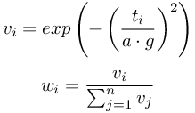

## DistanceSensor

Derived from [Device](reference/device.md#device).

```
DistanceSensor {
  MFVec3f    lookupTable     [ 0 0 0, 0.1 1000 0 ]
  SFString   type            "generic"
  SFInt32    numberOfRays    1        # [1,inf)
  SFFloat    aperture        1.5708   # [0,2pi]
  SFFloat    gaussianWidth   1
  SFFloat    resolution     -1
}
```

### Description

The [DistanceSensor](reference/distancesensor.md#distancesensor) node can be
used to model a generic sensor, an infra-red sensor, a sonar sensor, or a laser
range-finder. This device simulation is performed by detecting the collisions
between one or several sensor rays and objects in the environment. In case of
generic, sonar and laser type the collision occurs with the bounding objects of
[Solid](reference/solid.md#solid) nodes, whereas infra-red rays collision
detection uses the [Solid](reference/solid.md#solid) nodes themselves.

The rays of the [DistanceSensor](reference/distancesensor.md#distancesensor)
nodes can be displayed by checking the menu `View > Optional Rendering > Show
Distance Sensor Rays`. The red/green transition on the rays indicates the points
of intersection with the bounding objects.

### Field Summary

- `lookupTable`: a table used for specifying the desired response curve and noise
of the device. This table indicates how the ray intersection distances measured
by Webots must be mapped to response values returned by the function
`wb_distance_sensor_get_value()`. The first column of the table specifies the
input distances, the second column specifies the corresponding desired response
values, and the third column indicates the desired standard deviation of the
noise. The noise on the return value is computed according to a gaussian random
number distribution whose range is calculated as a percent of the response value
(two times the standard deviation is often referred to as the signal quality).
Note that the input values of a lookup table must always be positive and sorted
in increasing order.

    Let us consider a first example:

        lookupTable [ 0     1000  0,
                      0.1   1000  0.1,
                      0.2    400  0.1,
                      0.3     50  0.1,
                      0.37    30  0   ]

    The above lookup table means that for a distance of 0 meters, the sensor will
    return a value of 1000 without noise (0); for a distance of 0.1 meter, the
    sensor will return 1000 with a noise of standard deviation of 10 percent (100);
    for a distance value of 0.2 meters, the sensor will return 400 with a standard
    deviation of 10 percent (40), etc. Distance values not directly specified in the
    lookup table will be linearly interpolated. This can be better understood in
    below.

%figure "Sensor response versus obstacle distance"

%end

    A different graph is produced when the trend of the desired response value and
    the trend of the desired noise standard deviation have opposite sign. This is
    the case in the following example, where the response value increases with the
    input values but the noise decreases:

        lookupTable [ 0     1023  0,
                      0.02  1023  0.05,
                      4        0  0.4  ]

    The resulting range of measured values is shown in .

%figure "Sensor response versus obstacle distance with opposite response-noise increase"

%end

- `type`: one of "generic" (the default), "infra-red", "sonar" or "laser". Sensors
of type "infra-red" are sensitive to the objects' colors; light and red (RGB)
obstacles have a higher response than dark and non-red obstacles (see below for
more details).

    Sensors of type "sonar" and "laser" return the distance to the nearest object
    while "generic" and "infa-red" computes the average distance of all rays. Note
    however that sensors of type "sonar" will return the sonar range for each ray
    whose angle of incidence is greater than π/8 radians (see below for more
    details).

    Sensors of type "laser" can have only one ray and they have the particularity to
    draw a red spot at the point where this ray hits an obstacle. This red spot is
    visible on the camera images. If the red spot disappears due to depth fighting,
    then it could help increasing the `lineScale` value in
    [WorldInfo](reference/worldinfo.md#worldinfo) node that is used for computing
    its position offset.

- `numberOfRays`: number of rays cast by the sensor. The number of rays must be
equal to, or greater than 1 for "infra-red" and "sonar" sensors. `numberOfRays`
must be exactly 1 for "laser" sensors. If this number is larger than 1, then
several rays are used and the sensor measurement value is computed from the
weighted average of the individual rays' responses. By using multiple rays, a
more accurate model of the physical infra-red or ultrasound sensor can be
obtained. The sensor rays are distributed inside 3D-cones whose opening angles
can be tuned through the `aperture` field. See  for the ray distributions from
one to ten rays. The spacial distribution of the rays is as much as possible
uniform and has a left/right symmetry. There is no upper limit on the number of
rays; however, Webots' performance drops as the number of rays increases.

%figure "Predefined configurations for 1 through 10 sensor rays"

%end

- `aperture`: sensor aperture angle or laser beam radius. For the "infra-red" and
"sonar" sensor types, this field controls the opening angle (in radians) of the
cone of rays when multiple rays are used. For the "laser" sensor type, this
field specifies (in meters) the radius of the red spot drawn where the laser
beam hits an obstacle.

%figure "Weight distribution formulas"

%end

- `gaussianWidth`: width of the Gaussian distribution of sensor ray weights (for
"generic" and "infra-red" sensors). When averaging the sensor's response, the
individual weight of each sensor ray is computed according to a Gaussian
distribution as described in . where `w` is the weight of the *i*th ray, `t` is
the angle between the *i*th ray and the sensor axis, *a* is the aperture angle
of the sensor, *g* is the Gaussian width, and *n* is the number of rays. As
depicted in  , rays in the center of the sensor cone are given a greater weight
than rays in the periphery. A wider or narrower distribution can be obtained by
tuning the `gaussianWidth` field. An approximation of a flat distribution is
obtained if a sufficiently large number is chosen for the `gaussianWidth`. This
field is ignored for the "sonar" and "laser" DistanceSensor types.

%figure "Example distribution for 10 rays using a Gaussian width of 0.5"

%end

- `resolution`: This field allows to define the resolution of the sensor, the
resolution is the smallest change that it is able to measure. Setting this field
to -1 (default) means that the sensor has an 'infinite' resolution (it can
measure any infinitesimal change). This field accepts any value in the interval
(0.0, inf).

### DistanceSensor types

This table summarizes the difference between the three types of DistanceSensor.

Two different methods are used for calculating the distance from an object.
*Average* method computes the average of the distances measured by all the rays,
whereas *Nearest* method uses the shortest distance measured by any of the rays.

%figure "Summary of DistanceSensor types"
| type (field) | "generic" | "infra-red" | "sonar" | "laser" |
| --- | --- | --- | --- | --- |
| numberOfRays (field) | > 0 | > 0 | > 0 | 1 |
| Distance calculation | Average | Average | Nearest | Nearest |
| gaussianWidth (field) | Used | Used | Ignored | Ignored |
| Sensitive to red objects | No | Yes | No | No |
| Draws a red spot | No | No | No | Yes |
%%end

### Infra-Red Sensors

In the case of an "infra-red" sensor, the value returned by the lookup table is
modified by a reflection factor depending on the color properties of the object
hit by the sensor ray. The reflection factor is computed as follows: *f = 0.2 +
0.8 * red\_level* where *red\_level* is the level of red color of the object hit
by the sensor ray. This level is evaluated combining the `diffuseColor` and
`transparency` values of the object, the pixel value of the image texture and
the paint color applied on the object with the [Pen](reference/pen.md#pen)
device. Then, the distance value computed by the simulator is divided by the
reflection factor before the lookup table is used to compute the output value.

> **note**: Unlike other distance sensor rays, "infra-red" rays can detect solid parts of
the robot itself. It is thus important to ensure that no solid geometries
interpose between the sensor and the area to inspect.

### Sonar Sensors

In the case of a "sonar" sensor, the return value will be the last value entered
in the lookup table, i.e. the value corresponding to sonar sensor's range, if
the angle of incidence is greater than 22.5 degrees (π/8 radians). In other
words, sonar rays which lie outside the reflexion cone of aperture 45 degrees
never return and thus are lost for distance computation (see ).

%figure "Sonar sensor"

%end

### Line Following Behavior

Some support for [DistanceSensor](reference/distancesensor.md#distancesensor)
nodes used for reading the red color level of a textured floor is implemented.
This is useful to simulate line following behaviors. This feature is
demonstrated in the "rover.wbt" example (see in the
"projects/robots/mindstorms/worlds" directory of Webots). The ground texture
must be placed in a [Plane](reference/plane.md#plane).

### DistanceSensor Functions

#### Description

`wb_distance_sensor_enable()` allows the user to enable a distance sensor
measurement each `ms` milliseconds.

`wb_distance_sensor_disable()` turns the distance sensor off, saving computation
time.

The `wb_distance_sensor_get_sampling_period()` function returns the period given
into the `wb_distance_sensor_enable()` function, or 0 if the device is disabled.

`wb_distance_sensor_get_value()` returns the last value measured by the
specified distance sensor. This value is computed by the simulator according to
the lookup table of the
[DistanceSensor](reference/distancesensor.md#distancesensor) node. Hence, the
range of the return value is defined by this lookup table.

