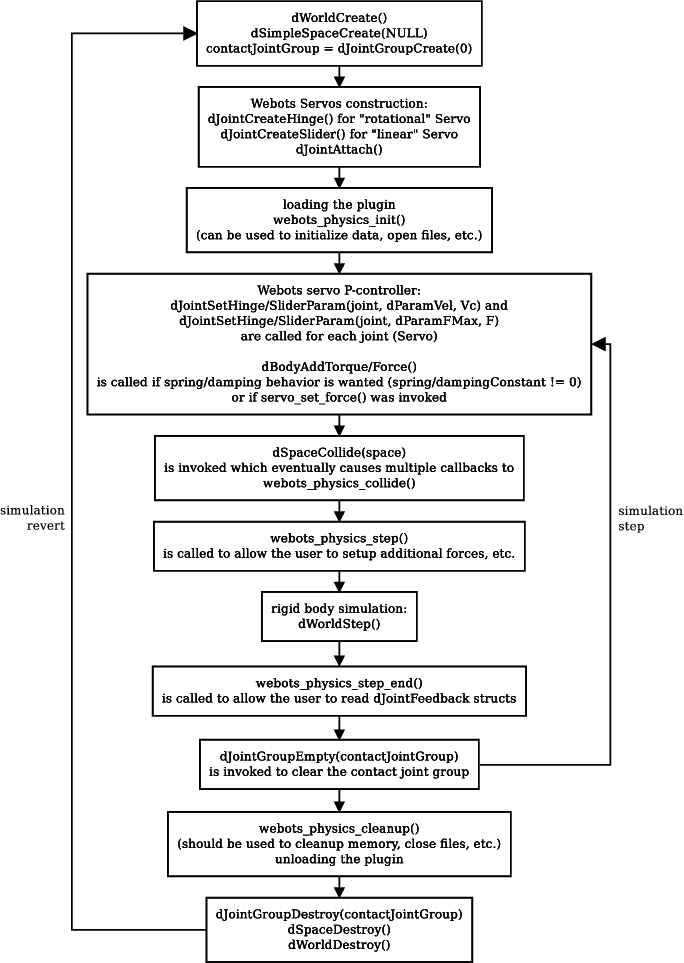

## Execution Scheme

The following diagram illustrates the sequence of execution of the plugin
callback functions. In addition, the principal interactions of Webots with the
ODE functions are indicated.

%figure "Physics Plugin Execution Scheme"

%end

