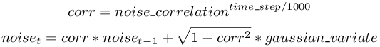

## GPS

Derived from [Device](device.md).

```
GPS {
  SFString   type              "satellite"
  SFFloat    accuracy          0
  SFFloat    noiseCorrelation  0
  SFFloat    resolution       -1
  SFFloat    speedNoise        0
  SFFloat    speedResolution   1
}
```

### Description

The [GPS](#gps) node is used to model a Global Positioning Sensor (GPS) which
can obtain information about its absolute position from the controller program.

### Field Summary

- `type`: This field defines the type of GPS technology used like "satellite" or
"laser" (currently ignored).

- `accuracy`: This field defines the precision of the GPS, that is the standard
deviation (expressed in meter) of the gaussian noise added to the position.

- `noiseCorrelation`: If a more accurate gps noise model than the simple gaussian
noise is required, this field can be used to define the noise correlation level.
The noise model is then approximated by a gaussian-correlated phenomena, which
capture for example the drift phenomena present in GPS. The value should be
between 0 and 1 and represents how much the noise from 1 second ago influence
the current noise, 0 means no influence (i.e. no correlation) and 1 means that
the noise will be constant (noise fully correlated with the noise from one
second ago). Internally the correlation factor corresponding to the sensor time
step is computed and the current noise is estimated using a Gauss-Markov process
as described in [this figure](#gauss-markov-process).

%figure "Gauss-Markov process"



%end

- `resolution`: This field allows to define the resolution of the sensor, the
resolution is the smallest change that it is able to measure. Setting this field
to -1 (default) means that the sensor has an 'infinite' resolution (it can
measure any infinitesimal change). This field accepts any value in the interval
(0.0, inf).

- `speedNoise`: This field defines the standard deviation (expressed in meter)
of the gaussian noise added to the speed measurements of the GPS.

- `speedResolution`: This field defines the resolution of the speed measurements,
the resolution is the smallest speed change that the GPS is able to measure.
Setting this field to -1 (default) means that the sensor has an 'infinite'
resolution (it can measure any infinitesimal change). This field accepts any
value in the interval (0.0, inf).

### GPS Functions

**Name**

**wb\_gps\_enable**, **wb\_gps\_disable**, **wb\_gps\_get\_sampling\_period**, **wb\_gps\_get\_values**, **wb\_gps\_get\_speed** - *enable, disable and read the GPS measurements*

{[C++](cpp-api.md#cpp_gps)}, {[Java](java-api.md#java_gps)}, {[Python](python-api.md#python_gps)}, {[Matlab](matlab-api.md#matlab_gps)}, {[ROS](ros-api.md)}

```c
#include <webots/gps.h>

void wb_gps_enable(WbDeviceTag tag, int ms);
void wb_gps_disable(WbDeviceTag tag);
int wb_gps_get_sampling_period(WbDeviceTag tag);
const double *wb_gps_get_values(WbDeviceTag tag);
const double wb_gps_get_speed(WbDeviceTag tag);
```

**Description**

`wb_gps_enable()` allows the user to enable a GPS measurement each `ms`
milliseconds.
The provided `ms` argument specifies the sensor's sampling period.
Note that the first measurement will be available only after the first sampling period elapsed.

`wb_gps_disable()` turns the GPS off, saving computation time.

The `wb_gps_get_sampling_period()` function returns the period given into the
`wb_gps_enable()` function, or 0 if the device is disabled.

The `wb_gps_get_values()` function returns the current [GPS](#gps) measurement.
The values are returned as a 3D-vector, therefore only the indices 0, 1, and 2
are valid for accessing the vector. The returned vector indicates the absolute
position of the [GPS](#gps) device. This position can either be expressed in the
cartesian coordinate system of Webots or using latitude-longitude-altitude,
depending on the value of the `gpsCoordinateSystem` field of the
[WorldInfo](worldinfo.md) node. The `gpsReference` field of the
[WorldInfo](worldinfo.md) node can be used to define the reference point of the
GPS.

The `wb_gps_get_speed()` function returns the current [GPS](#gps) speed in
meters per second.

> **note** [C, C++]:
The returned vector is a pointer to the internal values managed by the
[GPS](#gps) node, therefore it is illegal to free this pointer. Furthermore,
note that the pointed values are only valid until the next call to
`wb_robot_step()` or `Robot::step()`. If these values are needed for a longer
period they must be copied.

<!-- -->

> **note** [Python]:
`getValues()` returns the 3D-vector as a list containing three floats.

---

**Name**

**wb\_gps\_get\_coordinate\_system** - *get the gps coordinate system*

{[C++](cpp-api.md#cpp_gps)}, {[Java](java-api.md#java_gps)}, {[Python](python-api.md#python_gps)}, {[Matlab](matlab-api.md#matlab_gps)}, {[ROS](ros-api.md)}

```c
#include <webots/gps.h>

int wb_gps_get_coordinate_system(WbDeviceTag tag);
```

**Description**

This function allows the user to retrieve the coordinate system type defined by
the `gpsCoordinateSystem` field of the [WorldInfo](worldinfo.md) node. If the
value of the `gpsCoordinateSystem` field is "local" then this function returns
WB\_GPS\_LOCAL\_COORDINATE, and otherwise it returns WB\_GPS\_WGS84\_COORDINATE.

---

**Name**

**wb\_gps\_convert\_to\_degrees\_minutes\_seconds** - *convert decimal degrees to degrees minutes seconds*

{[C++](cpp-api.md#cpp_gps)}, {[Java](java-api.md#java_gps)}, {[Python](python-api.md#python_gps)}, {[Matlab](matlab-api.md#matlab_gps)}, {[ROS](ros-api.md)}

```c
#include <webots/gps.h>

const char * wb_gps_convert_to_degrees_minutes_seconds(double decimal_degrees);
```

**Description**

This function converts a decimal degrees coordinate into a string representing
the coordinate in the degrees minutes seconds format.

> **note**:
Your system should support UTF-8 otherwise you may get strange characters
instead of the degree, minute and second symbols.

<!-- -->

> **note** [C]:
The returned string should be deallocated by the user.
