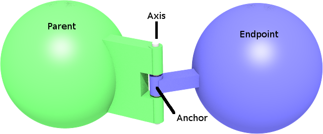

## HingeJoint

Derived from [Joint](joint.md).

```
HingeJoint {
  MFNode   device   []  # RotationalMotor, PositionSensor and Brake
  SFFloat .position 0   # (rad) initial position
}
```

### Description

%figure "Hinge joint"



%end

The [HingeJoint](#hingejoint) node can be used to model a hinge, i.e. a joint
allowing only a rotational motion around a given axis (1 degree of freedom). It
inherits [Joint](joint.md)'s `jointParameters` field. This field can be filled
with a [HingeJointParameters](hingejointparameters.md) only. If empty,
[HingeJointParameters](hingejointparameters.md) default values apply.

### Field Summary

- `device`: This field optionally specifies a
[RotationalMotor](rotationalmotor.md), an angular
[PositionSensor](positionsensor.md) and/or a [Brake](brake.md) device. If no
motor is specified, the joint is passive joint.

- `.position`: see [joint's hidden position
field](joint.md#joint-s-hidden-position-fields).
