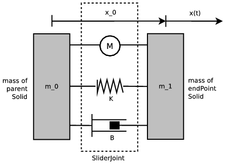

## JointParameters

```
JointParameters {
  field SFFloat position        0 # current position (m or rad)
  field SFVec3f axis        0 0 1 # displacement axis (m)
  field SFFloat minStop         0 # low stop position (m or rad)
  field SFFloat maxStop         0 # high stop position (m or rad)
  field SFFloat springConstant  0 # spring constant (N/m or Nm)
  field SFFloat dampingConstant 0 # damping constant (Ns/m or Nms)
  field SFFloat staticFriction  0 # friction constant (Ns/m or Nms)
}
```

> **note**:
The default value of the axis field may change in a derived class. For instance,
the axis default value of an [HingeJointParameters](hingejointparameters.md) is
`1 0 0`.

### Description

The [JointParameters](#jointparameters) node is a concrete base node used to
specify various joint parameters related to an axis along which, or around
which, the motion is allowed. As an instantiated node it can be used within the
jointParameters field of [SliderJoint](sliderjoint.md) or within the
jointParameters2 field of [Hinge2Joint](hinge2joint.md). Unlike the other joint
parameters node, it has no anchor.

### Field Summary

- The `position` field represents the current *position* of the joint, in radians
or meters. For an hinge, `position` represents the current rotation angle in
radians. For a slider, `position` represents the magnitude of the current
translation in meters.

- The `minPosition` and `maxPosition` fields specify *soft limits* for the target
position. These fields are described in more detail in the "Joint Limits"
section, see below.

- The `minStop` and `maxStop` fields specify the position of physical (or
mechanical) stops. These fields are described in more detail in the "Joint
Limits" section, see below.

- The `springConstant` and `dampingConstant` fields allow the addition of spring
and/or damping behavior to the joint. These fields are described in more detail
in the "Springs and Dampers" section, see below.

- The `staticFriction` field defines add a simple static friction force opposed to
the joint motion.

### Units

Rotational joint units ([HingeJoint](hingejoint.md),
[Hinge2Joint](hinge2joint.md)) are expressed in *radians* while linear joint
units ([SliderJoint](sliderjoint.md)) are expressed in *meters*. See [this
table](#joint-units):

%figure "Joint Units"

|          | Rotational    | Linear     |
| -------- | ------------- | ---------- |
| Position | rad (radians) | m (meters) |

%end

### Initial Transformation and Position

%figure "HingeJoint"


%end

%figure "SliderJoint"


%end

The `position` field is a scalar representing an angle (in radians) or a
distance (in meters) computed with respect to the initial `translation` and
`rotation` of the [Joint](joint.md)'s [Solid](solid.md) child. If its value is
zero, then the [Joint](joint.md)'s child is *by definition* set with its initial
`translation` and `rotation`. For a joint with one or two rotational degrees of
freedom (e.g., [HingeJoint](hingejoint.md), [Hinge2Joint](hinge2joint.md)), the
`position` field value is the rotation angle around one the joint axes that was
applied to the [Joint](joint.md)'s child initially in zero position. For a
slider joint, `position` is the translation length along the sliding axis that
was applied to the [Joint](joint.md)'s child initially in zero position.

For example if we have a [HingeJoint](hingejoint.md) and a `position` field
value of 1.5708, this means that this [HingeJoint](joint.md) is 90 degrees from
its initial rotation with respect to the hinge rotation axis. The values passed
to the `wb_motor_set_position()` function are specified with respect to the zero
position. The values of the `minStop` and `maxStop` fields are also defined with
respect to the zero position.

### Joint Limits

The `minStop` and `maxStop` fields define the *hard limits* of the joint. Hard
limits represent physical (or mechanical) bounds that cannot be overrun by any
force; they are defined with respect to the joint `position`. Hard limits can be
used, for example, to simulate both end caps of a hydraulic or pneumatic piston
or to restrict the range of rotation of a hinge. When used for a rotational
motion the value of `minStop` must be in the range [-π, 0] and `maxStop` must
be in the range [0, π]. When both `minStop` and `maxStop` are zero (the
default), the hard limits are deactivated. The joint hard limits use ODE joint
stops (for more information see the ODE documentation on `dParamLoStop` and
`dParamHiStop`).

Finally, note that when both soft (`minPosition` and `maxPosition`, see the
[Motor](motor.md)'s "Motor Limits" section) and hard limits (`minStop` and
`maxStop`) are activated, the range of the soft limits must be included in the
range of the hard limits, such that `minStop <= minValue` and `maxStop>=
maxValue`.

### Springs and Dampers

The `springConstant` field specifies the value of the spring constant (or spring
stiffness), usually denoted as *K*. The `springConstant` must be positive or
zero. If the `springConstant` is zero (the default), no spring torque/force will
be applied to the joint. If the `springConstant` is greater than zero, then a
spring force will be computed and applied to the joint in addition to the other
forces (i.e., motor force, damping force). The spring force is calculated
according to Hooke's law: *F = -Kx*, where *K* is the `springConstant` and *x*
is the current joint position as represented by the `position` field. Therefore,
the spring force is computed so as to be proportional to the current joint
position, and to move the joint back to its initial position. When designing a
robot model that uses springs, it is important to remember that the spring's
resting position for each joint will correspond to the initial position of the
joint. The only expection arise when the closest upper [Solid](solid.md) of the
[Joint](joint.md) is passive, i.e. the `physics` field is not defined. In this
case the spring force direction is inverted.

The `dampingConstant` field specifies the value of the joint damping constant.
The value of `dampingConstant` must be positive or zero. If `dampingConstant` is
zero (the default), no damping torque/force will be added to the joint. If
`dampingConstant` is greater than zero, a damping torque/force will be applied
to the joint in addition to the other forces (i.e., motor force, spring force).
This damping torque/force is proportional to the effective joint velocity: *F =
-Bv*, where *B* is the damping constant, and *v = dx/dt* is the effective joint
velocity computed by the physics simulator.

%figure "Mechanical Diagram of a Slider Joint"



%end

As you can see in (see  [this figure](#mechanical-diagram-of-a-slider-joint)), a
[Joint](joint.md) creates a joint between two masses *m<sub>0</sub>* and
*m<sub>1</sub>*. The mass *m<sub>0</sub>* is defined by the
[Physics](physics.md) node in the closest upper [Solid](solid.md) of the
[Joint](joint.md). The mass *m<sub>1</sub>* is defined by the
[Physics](physics.md) node of the [Solid](solid.md) placed into the `endPoint`
of the [Joint](joint.md). The value *x<sub>0</sub>* corresponds to the anchor
position of the [Joint](joint.md) defined in the `anchor` field of a
[JointParameters](#jointparameters) node. The position *x* corresponds to the
current position of the [Joint](joint.md) defined in the `position` field of a
[JointParameters](#jointparameters) node.
