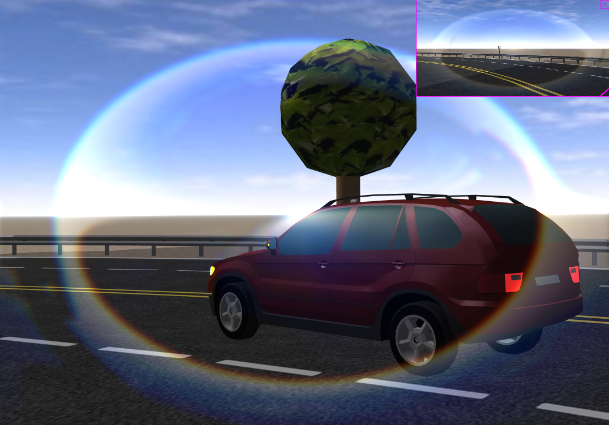

## LensFlare

```
LensFlare {
  SFBool  occlusion              FALSE
  SFFloat transparency           0
  MFVec2f haloSizesAndPositions  [0.17 0.5, 0.08 0.25, 0.33 0.12]
  MFVec2f burstSizesAndPositions [0.33 0.5, 0.16 0.33, 0.5 0.1]
}
```

### Description

%figure "Lens flare effect"



%end

The [LensFlare](#lensflare) node can be added in the `lensFlare` field of any [Camera](camera.md) or [Viewpoint](viewpoint.md) to simulate lens flare. The lens flare effect is due to the light being scattered in lens systems through generally unwanted image formation mechanisms, such as internal reflections and scattering from material inhomogeneities in the lens. To simulate a lens flare, a variable number of images called *halos* and *bursts* are added along a line from the light position to a point in front of the [Camera](camera.md) or [Viewpoint](viewpoint.md).

### Field Summary

- The `occlusion` field specifies whether or not obstacles between the [Camera](camera.md) or [Viewpoint](viewpoint.md) and the light should disable the lens flare effect. By default, the `occlusion` field is set to FALSE because the occlusion detection is computationally expensive and should be avoided when not needed.

- The `transparency` field specifies the transparency level of the flare images, with 0.0 (the default) the images will appear completely opaque, and with 1.0 they will appear completely transparent. Semi-transparent images will make the flare effect lighter.

- The `haloSizesAndPositions` field specifies the size and position along the line mentioned previously for each halo image. The first component defines the reference size of the halo image in meters (the reference size is the size of the halo image considering the light is at a distance of 1 meter, if the light is closer or farther, the image is scaled accordingly). The second component defines the position along the line, 0.0 means at light position and 1.0 means in front of the [Camera](camera.md) or [Viewpoint](viewpoint.md). You are allowed to set position values outside the [0;1] range, but it is recommended to remain in this range to have realistic effects. Furthermore the number of elements defines the number of halo images.

- The `burstSizesAndPositions` field specifies the size and position along the line mentioned previously for each burst image. The first component defines the reference size of the burst image in meters (the reference size is the size of the burst image considering the light is at a distance of 1 meter, if the light is closer or farther, the image is scaled accordingly). The second component defines the position along the line, 0.0 means at light position and 1.0 means in front of the [Camera](camera.md) or [Viewpoint](viewpoint.md). You are allowed to set position values outside the [0;1] range, but it is recommended to remain in this range to have realistic effects. Furthermore the number of elements defines the number of burst images.
