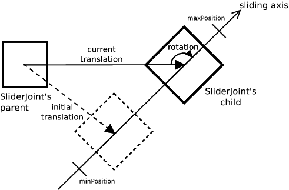
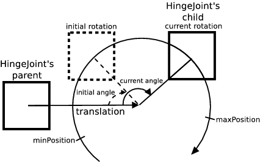
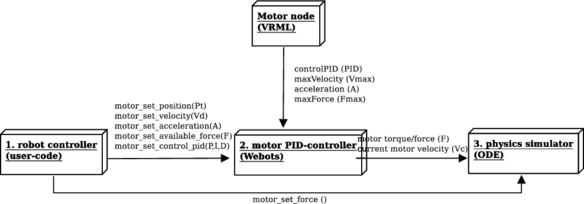

## Motor

Derived from [Device](device.md#device).

```
Motor {
  SFFloat maxVelocity  10 # (m/s or rad/s): (0,inf)
  SFVec3f controlPID   10 0 0 # PID gains: (0,inf), [0, inf), [0, inf)
  SFFloat acceleration -1 # (m/s^2 or rad/s^2): -1 or (0,inf)
  SFFloat minPosition  0  # (m or rad): (-inf,inf) or [-pi, pi]
  SFFloat maxPosition  0  # (m or rad): (-inf,inf) or [-pi, pi]
}
```

### Description

A [Motor](motor.md#motor) node is an abstract node (not instantiated) whose
derived classes can be used in a mechanical simulation to power a joint hence
producing a motion along, or around, one of its axes.

A [RotationalMotor](rotationalmotor.md#rotationalmotor) can power a
[HingeJoint](hingejoint.md#hingejoint) (resp. a
[Hinge2Joint](hinge2joint.md#hinge2joint)) when set inside the `device` (resp.
`device` or `device2`) field of these nodes. It produces then a rotational
motion around the choosen axis. Likewise, a
[LinearMotor](linearmotor.md#linearmotor) can power a
[SliderJoint](hingejoint.md#hingejoint), producing a sliding motion along its
axis.

### Field Summary

- The `maxVelocity` field specifies both the upper limit and the default value for
the motor *velocity*. The *velocity* can be changed at run-time with the
`wb_motor_set_velocity()` function. The value should always be positive (the
default is 10).

- The first coordinate of `controlPID` field specifies the initial value of the
*P* parameter, which is the *proportional gain* of the motor PID-controller. A
high *P* results in a large response to a small error, and therefore a more
sensitive system. Note that by setting *P* too high, the system can become
unstable. With a small *P*, more simulation steps are needed to reach the target
position, but the system is more stable.

    The second coordinate of `controlPID` field specifies the initial value of the
    *I* parameter, which is the *integral gain* of the motor PID-controller. The
    integral term of the PID controller is defined as the product of the error
    integral over time by *I*. This term accelerates the movement towards target
    position and eliminates the residual steady-state error which occurs with a pure
    proportional controller. However, since the integral term represents accumulated
    errors from the past, it can cause the present value to overshoot the target
    position.

    The third coordinate `controlPID` field specifies the initial value of the *D*
    parameter, which is the *derivative gain* of the motor PID-controller. The
    derivative term of the PID-controller is defined as the product of the error
    derivative with respect to time by *D*. This term predicts system behavior and
    thus improves settling time and stability of the system.

    The value of *P, I* and *D* can be changed at run-time with the
    `wb_motor_set_control_pid()` function.

- The `acceleration` field defines the default acceleration of the P-controller. A
value of -1 (infinite) means that the acceleration is not limited by the
P-controller. The acceleration can be changed at run-time with the
`wb_motor_set_acceleration()` function.

- The `position` field represents the current *position* of the
[Motor](motor.md#motor), in radians or meters. For a rotational motor,
`position` represents the current rotation angle in radians. For a linear motor,
`position` represents the magnitude of the current translation in meters.

- The `minPosition` and `maxPosition` fields specify *soft limits* for the target
position. These fields are described in more detail in the "Motor Limits"
section, see below.

### Units

By *motor position*, we mean joint position as defined in
[JointParameters](jointparameters.md#jointparameters). Rotational motors units
are expressed in *radians* while linear motors units are expressed in *meters*.
See :

%figure "Motor Units"

|  | Rotational | Linear |
| --- | --- | --- |
| Position | rad (radians) | m (meters) |
| Velocity | rad/s (radians / second) | m/s (meters / second) |
| Acceleration | rad/s^2 (radians / second^2) | m/s^2 (meters / second^2) |

%%end

### Initial Transformation and Position

The `minPosition` and `maxPosition` are defined with respect to joint's zero
position (see description of the `position` field in
[JointParameters](jointparameters.md#jointparameters)).

%figure "Linear Motor"



%end

%figure "Rotational Motor"



%end

### Position Control

The standard way of operating a [Motor](motor.md#motor) is to control the
position directly (*position control*). The user specifies a target position
using the `wb_motor_set_position()` function, then the P-controller takes into
account the desired velocity, acceleration and motor force in order to move the
motor to the target position. See .

In Webots, position control is carried out in three stages, as depicted in . The
first stage is performed by the user-specified controller (1) that decides which
position, velocity, acceleration and motor force must be used. The second stage
is performed by the motor P-controller (2) that computes the current velocity of
the motor *V<sub>c</sub>*. Finally, the third stage (3) is carried out by the
physics simulator (ODE joint motors).

%figure "Motor control"



%end

At each simulation step, the PID-controller (2) recomputes the current velocity
*Vc* according to following algorithm:

```
error = Pt - Pc;
error_integral += error * ts;
error_derivative = (previous_error - error) / ts;
Vc = P * error + D * error_derivative + I * error_integral ;
if (abs(Vc) > Vd)
  Vc = sign(Vc) * Vd;
if (A != -1) {
  a = (Vc - Vp) / ts;
  if (abs(a) > A)
    a = sign(a) * A;
  Vc = Vp + a * ts;
}
```

where  *V<sub>c</sub>* is the current motor velocity in rad/s or m/s, *P, I* and
*D* are the PID-control gains specified in the `controlPID` field, or set with
`wb_motor_set_control_pid()`, *P<sub>t</sub>* is the *target position* of the
motor set by the function `wb_motor_set_position()`, *P<sub>c</sub>* is the
current motor position as reflected by the `position` field, *V<sub>d</sub>* is
the desired velocity as specified by the `maxVelocity` field (default) or set
with `wb_motor_set_velocity()`, *a* is the acceleration required to reach *Vc*
in one time step, *V<sub>p</sub>* is the motor velocity of the previous time
step, *t<sub>s</sub>* is the duration of the simulation time step as specified
by the `basicTimeStep` field of the [WorldInfo](worldinfo.md#worldinfo) node
(converted in seconds), and *A* is the acceleration of the motor as specified by
the `acceleration` field (default) or set with `wb_motor_set_acceleration()`.

> **note**: *error_integral* and *previous_error* are both reset to *0* after every call of
`wb_motor_set_control_pid()`.

### Velocity Control

The motors can also be used with *velocity control* instead of *position
control*. This is obtained with two function calls: first the
`wb_motor_set_position()` function must be called with `INFINITY` as a position
parameter, then the desired velocity, which may be positive or negative, must be
specified by calling the `wb_motor_set_velocity()` function. This will initiate
a continuous motor motion at the desired speed, while taking into account the
specified acceleration and motor force. Example:

```
wb_motor_set_position(motor, INFINITY);
wb_motor_set_velocity(motor, 6.28);  // 1 rotation per second
```

`INFINITY` is a C macro corresponding to the IEEE 754 floating point standard.
It is implemented in the C99 specifications as well as in C++. In Java, this
value is defined as `Double.POSITIVE_INFINITY`. In Python, you should use
`float('inf')`. Finally, in Matlab you should use the `inf` constant.

### Force and Torque Control

The position (resp. velocity) control described above are performed by the
Webots PID-controller and ODE's joint motor implementation (see ODE
documentation). As an alternative, Webots does also allow the user to directly
specify the amount of force (resp. torque) that must be applied by a
[Motor](motor.md#motor). This is achieved with the `wb_motor_set_force()` (resp.
`wb_motor_set_torque()`) function which specifies the desired amount of forces
(resp. torques) and switches off the PID-controller and motor force (resp. motor
torque). A subsequent call to `wb_motor_set_position()` restores the original
*position control*. Some care must be taken when using *force control*. Indeed
the force (resp. torque) specified with `wb_motor_set_force()` (resp.
`wb_motor_set_torque()`) is applied to the [Motor](motor.md#motor) continuously.
Hence the [Motor](motor.md#motor) will infinitely accelerate its rotational or
linear motion and eventually *explode* unless a functional force control (resp.
torque control) algorithm is used.

%figure "Motor Control Summary"

|  | position control | velocity control | force or torque control |
| --- | --- | --- | --- | --- |
| uses PID-controller | yes | no | no |
| wb\_motor\_set\_position() | * specifies the desired position | should be set to INFINITY | switches to position/velocity control |
| wb\_motor\_set\_velocity() | specifies the max velocity | * specifies the desired velocity | is ignored |
| wb\_motor\_set\_acceleration() | specifies the max acceleration | specifies the max acceleration | is ignored |
| wb\_motor\_set\_available\_force() (resp. wb\_motor\_set\_available\_torque()) | specifies the available force (resp. torque) | specifies the available force (resp. torque) | specifies the max force (resp. max torque) |
| wb\_motor\_set\_force() (resp. wb\_motor\_set\_torque()) | switches to force control (resp. torque control) | switches to force control (resp. torque control) | * specifies the desired force (resp. torque) |

%%end

### Motor Limits

The `minPosition` and `maxPosition` fields define the *soft limits* of the
motor. Motor zero position and joint zero position coincide (see description of
the `position` field in [JointParameters](jointparameters.md#jointparameters)).
Soft limits specify the *software* boundaries beyond which the PID-controller
will not attempt to move. If the controller calls `wb_motor_set_position()` with
a target position that exceeds the soft limits, the desired target position will
be clipped in order to fit into the soft limit range. Valid limits values
depends on the motor position, i.e. `minPosition` must always be less than or
equal to the motor position and `maxPosition` must always be greater than or
equal to the motor position. When both `minPosition` and `maxPosition` are zero
(the default), the soft limits are deactivated. Note that the soft limits can be
overstepped when an external force which exceeds the motor force is applied to
the motor. For example, it is possible that the weight of a robot exceeds the
motor force that is required to hold it up.

Finally, note that when both soft (`minPosition` and `maxPosition`) and hard
limits (`minStop` and `maxStop`, see
[JointParameters](jointparameters.md#jointparameters)) are activated, the range
of the soft limits must be included in the range of the hard limits, such that
`minStop <= minValue` and `maxStop>= maxValue`. Moreover a simulation
instability can appear if `position` is exactly equal to one of the bounds
defined by the `minStop` and `maxStop` fields at the simulation startup.
Warnings are displayed if theses rules are not respected.

### Motor Functions

#### Name

**wb\_motor\_set\_position**, **wb\_motor\_set\_velocity**, **wb\_motor\_set\_acceleration**, **wb\_motor\_set\_available\_force**, **wb\_motor\_set\_available\_torque**, **wb\_motor\_set\_control\_pid**, **wb\_motor\_get\_target\_position**, **wb\_motor\_get\_min\_position**, **wb\_motor\_get\_max\_position**, **wb\_motor\_get\_velocity**, **wb\_motor\_get\_max\_velocty**, **wb\_motor\_get\_acceleration**, **wb\_motor\_get\_available\_force**, **wb\_motor\_get\_max\_force**, **wb\_motor\_get\_available\_torque**, **wb\_motor\_get\_max\_torque** - *change the parameters of the PID-controller*

{[C++](cpp-api.md)}, {[Java](java-api.md)}, {[Python](python-api.md)}, {[Matlab](matlab-api.md)}

``` c
#include <webots/motor.h>

void wb_motor_set_position(WbDeviceTag tag, double position)
void wb_motor_set_velocity(WbDeviceTag tag, double velocity)
void wb_motor_set_acceleration(WbDeviceTag tag, double acceleration)
void wb_motor_set_available_force(WbDeviceTag tag, double force)
void wb_motor_set_available_torque(WbDeviceTag tag, double torque)
void wb_motor_set_control_pid(WbDeviceTag tag, double p, double i, double d)
double wb_motor_get_target_position(WbDeviceTag tag)
double wb_motor_get_min_position(WbDeviceTag tag)
double wb_motor_get_max_position(WbDeviceTag tag)
double wb_motor_get_velocity(WbDeviceTag tag)
double wb_motor_get_max_velocity(WbDeviceTag tag)
double wb_motor_get_acceleration(WbDeviceTag tag)
double wb_motor_get_available_force(WbDeviceTag tag)
double wb_motor_get_max_force(WbDeviceTag tag)
double wb_motor_get_available_torque(WbDeviceTag tag)
double wb_motor_get_max_torque(WbDeviceTag tag)
```

#### Description

The `wb_motor_set_position()` function specifies a new target position that the
PID-controller will attempt to reach using the current velocity, acceleration
and motor torque/force parameters. This function returns immediately
(asynchronous) while the actual motion is carried out in the background by
Webots. The target position will be reached only if the physics simulation
allows it, that means, if the specified motor force is sufficient and the motion
is not blocked by obstacles, external forces or the motor's own spring force,
etc. It is also possible to wait until the [Motor](motor.md#motor) reaches the
target position (synchronous) like this:

``` c
void motor_set_position_sync(WbDeviceTag tag_motor, WbDeviceTag tag_sensor, double target, int delay) {
  const double DELTA = 0.001;  // max tolerated difference
  wb_motor_set_position(tag_motor, target);
  wb_position_sensor_enable(tag_sensor, TIME_STEP);
  double effective;  // effective position
  do {
    wb_robot_step(TIME_STEP);
    delay -= TIME_STEP;
    effective = wb_position_sensor_get_value(tag_sensor);
  }
  while (fabs(target - effective) > DELTA && delay > 0);
  wb_position_sensor_disable(tag_sensor);
}
```

The `INFINITY` (*#include <math.h>*) value can be used as the second argument to
the `wb_motor_set_position()` function in order to enable an endless rotational
(or linear) motion. The current values for velocity, acceleration and motor
torque/force are taken into account. So for example, `wb_motor_set_velocity()`
can be used for controlling the velocity of the endless rotation:

``` c
// velocity control
wb_motor_set_position(tag, INFINITY);
wb_motor_set_velocity(tag, desired_speed);  // rad/s
```

> **note** [C++]: In C++ use `std::numeric_limits<double>::infinity()` instead of INFINITY

<!-- -->

> **note** [Java]: In Java use `Double.POSITIVE_INFINITY` instead of INFINITY

<!-- -->

> **note** [Python]: In Python use `float('+inf')` instead of INFINITY

<!-- -->

> **note** [Matlab]: In MATLAB use `inf` instead of INFINITY

The `wb_motor_get_target_position()` function allows to get the target position.
This value matches with the argument given to the last `wb_motor_set_position()`
function call.

The `wb_motor_set_velocity()` function specifies the velocity that motor should
reach while moving to the target position. In other words, this means that the
motor will accelerate (using the specified acceleration, see below) until the
target velocity is reached. The velocity argument passed to this function cannot
exceed the limit specified in the `maxVelocity` field. The specified velocity
can be retrieved using the `wb_motor_get_velocity()` function and
`wb_motor_get_max_velocity()` function returns the limit specified in the
`maxVelocity` field. Note that if the velocity is not explicitly set using
`wb_motor_set_velocity()`, then `wb_motor_get_velocity()` and
`wb_motor_get_max_velocity()` functions return the same value.

The `wb_motor_set_acceleration()` function specifies the acceleration that the
PID-controller should use when trying to reach the specified velocity. Note that
an infinite acceleration is obtained by passing -1 as the `acc` argument to this
function. The specified acceleration overwrites the `acceleration` field value
and can be retrieved using the `wb_motor_get_acceleration()` function.

The `wb_motor_set_available_force()` (resp. `wb_motor_set_available_torque()`)
function specifies the maximum force (resp. torque) that will be available to
the motor to carry out the requested motion. The motor force/torque specified
with this function cannot exceed the value specified in the
`maxForce`/`maxTorque` field. The specified force (resp. torque) can be
retrieved using the `wb_motor_get_available_force()` (resp.
`wb_motor_get_available_torque()`) function and `wb_motor_get_max_force()`
(reps. `wb_motor_get_max_torque()`) function returns the limit specified in the
`maxForce` (resp. `maxTorque`) field. Note that if the force/torque is not
explicitly set using `wb_motor_set_[force|torque]()`, then
`wb_motor_get_available_[force|torque]()` and
`wb_motor_get_max_[force|torque]()` functions return the same value.

The `wb_motor_set_control_pid()` function changes the values of the gains *P, I*
and *D* in the PID-controller. These parameters are used to compute the current
motor velocity *V<sub>c</sub>* from the current position *P<sub>c</sub>* and
target position *P<sub>t</sub>*, such that *V<sub>c</sub>* where *error =
P<sub>t</sub><sub>c</sub>*. With a small *P*, a long time is needed to reach the
target position, while too large a *P* can make the system unstable. The default
value of *P, I* and *D* are specified by the `controlPID` field of the
corresponding [Motor](motor.md#motor) node.

The `wb_motor_get_[min|max]_position()` functions allow to get the values of
respectively the `minPosition` and the `maxPosition` fields.

---

#### Name

**wb\_motor\_enable\_force\_feedback**, **wb\_motor\_get\_force\_feedback**, **wb\_motor\_get\_force\_feedback\_sampling\_period**, **wb\_motor\_disable\_force\_feedback**, **wb\_motor\_enable\_torque\_feedback**, **wb\_motor\_get\_torque\_feedback**, **wb\_motor\_get\_torque\_feedback\_sampling\_period**, **wb\_motor\_disable\_torque\_feedback** - *get the motor force or torque currently used by a motor*

{[C++](cpp-api.md)}, {[Java](java-api.md)}, {[Python](python-api.md)}, {[Matlab](matlab-api.md)}

``` c
#include <webots/motor.h>

void wb_motor_enable_force_feedback(WbDeviceTag tag, int ms)
void wb_motor_disable_force_feedback(WbDeviceTag tag)
int wb_motor_get_force_feedback_sampling_period(WbDeviceTag tag)
double wb_motor_get_force_feedback(WbDeviceTag tag)
void wb_motor_enable_torque_feedback(WbDeviceTag tag, int ms)
void wb_motor_disable_torque_feedback(WbDeviceTag tag)
int wb_motor_get_torque_feedback_sampling_period(WbDeviceTag tag)
double wb_motor_get_torque_feedback(WbDeviceTag tag)
```

#### Description

The `wb_motor_enable_force_feedback()` (resp.
`wb_motor_enable_torque_feedback()`) function activates force (resp. torque)
feedback measurements for the specified motor. A new measurement will be
performed each `ms` milliseconds; the result must be retrieved with the
`wb_motor_get_force_feedback()` (resp. `wb_motor_get_torque_feedback()`)
function.

The `wb_motor_get_force_feedback()` (resp. `wb_motor_get_torque_feedback()`)
function returns the most recent motor force (resp. torque) measurement. This
function measures the amount of motor force (resp. torque) that is currently
being used by the motor in order to achieve the desired motion or hold the
current position. For a "rotational" motor, the returned value is a torque
[N*m]; for a "linear" motor, the value is a force [N]. The returned value is an
approximation computed by the physics engine, and therefore it may be
inaccurate. The returned value normally does not exceed the available motor
force (resp. torque) specified with `wb_motor_set_force()` (resp.
`wb_motor_set_torque()`). The default value is provided by the `maxForce` (resp.
`maxTorque` field. Note that this function measures the *current motor force*
(resp. *torque*) exclusively, all other external or internal forces (resp.
torques) that may apply to the motor are ignored. In particular,
`wb_motor_get_force_feedback()` (resp. `wb_motor_get_torque_feedback()`) does
not measure:

- The spring and damping forces that apply when the `springConstant` or
`dampingConstant` fields are non-zero.
- The force specified with the `wb_motor_set_force()` (resp.
`wb_motor_set_torque()`) function.
- The *constraint forces or torques* that restrict the motor motion to one degree
of freedom (DOF). In other words, the forces or torques applied outside of the
motor DOF are ignored. Only the forces or torques applied in the DOF are
considered. For example, in a "linear" motor, a force applied at a right angle
to the sliding axis is completely ignored. In a "rotational" motor, only the
torque applied around the rotation axis is considered.

Note that these functions applies only to *physics-based* simulations.
Therefore, the `physics` and `boundingObject` fields of related
[Solid](solid.md#solid) nodes must be defined for these functions to work
properly. Moreover they don't work for [Motor](motor.md#motor) nodes used to
power a [Track](track.md#track) node.

If `wb_motor_get_force_feedback()` (resp. `wb_motor_get_torque_feedback()`) was
not previously enabled, the return value is undefined.

The `wb_motor_get_force_feedback_sampling_period()` (resp.
`wb_motor_get_torque_feedback_sampling_period()`) function returns the period
given in the `wb_motor_enable_force_feedback()` (resp.
`wb_motor_enable_force_feedback()`) function, or 0 if the device is disabled.

---

#### Name

**wb\_motor\_set\_force**, **wb\_motor\_set\_torque** - *direct force or torque control*

{[C++](cpp-api.md)}, {[Java](java-api.md)}, {[Python](python-api.md)}, {[Matlab](matlab-api.md)}

``` c
#include <webots/motor.h>

void wb_motor_set_force(WbDeviceTag tag, double force)
void wb_motor_set_torque(WbDeviceTag tag, double torque)
```

#### Description

As an alternative to the PID-controller, the `wb_motor_set_force()` (resp.
`wb_motor_set_torque()`) function allows the user to directly specify the amount
of force (resp. torque) that must be applied by a motor. This function bypasses
the PID-controller and ODE joint motors; it adds the force to the physics
simulation directly. This allows the user to design a custom controller, for
example a PID controller. Note that when `wb_motor_set_force()` (resp.
`wb_motor_set_torque()`) is invoked, this automatically resets the force
previously added by the PID-controller.

In a "rotational" motor, the *torque* parameter specifies the amount of torque
[N.m] that will be applied around the motor rotation axis. In a "linear" motor,
the *force* parameter specifies the amount of force [N] that will be applied
along the sliding axis. A positive *force* (resp. *torque*) will move the bodies
in the positive direction, which corresponds to the direction of the motor when
the `position` field increases. When invoking `wb_motor_set_force()` (resp.
`wb_motor_set_torque()`), the specified *force* (resp. *torque*) parameter
cannot exceed the current motor force (resp. torque) of the motor specified with
`wb_motor_set_force()` (resp. `wb_motor_set_torque()`) and defaulting to the
value of the `maxForce` (resp. `maxTorque`) field.

Note that this function applies only to *physics-based* simulation. Therefore,
the `physics` and `boundingObject` fields of the [Motor](motor.md#motor) node
must be defined for this function to work properly.

It is also possible, for example, to use this function to implement springs or
dampers with controllable properties. The example in
"projects/samples/howto/worlds/force\_control.wbt" demonstrates the usage of
`wb_motor_set_force()` for creating a simple spring and damper system.

---

#### Name

**wb\_motor\_get\_type** - *get the motor type*

{[C++](cpp-api.md)}, {[Java](java-api.md)}, {[Python](python-api.md)}, {[Matlab](matlab-api.md)}

``` c
#include <webots/motor.h>

int wb_motor_get_type(WbDeviceTag tag)
```

#### Description

This function allows to retrieve the motor type defined by the `type` field. If
the value of the `type` field is "linear", this function returns WB\_LINEAR, and
otherwise it returns WB\_ANGULAR.

%figure "Return values for the *wb_motor_get_type()* function"

| Motor.type | return value |
| --- | --- |
| "rotational" | WB\_ANGULAR |
| "linear" | WB\_LINEAR |

%%end

