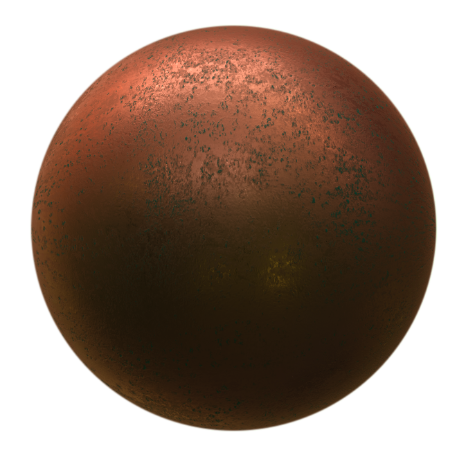

## PBRAppearance

```
PBRAppearance {
  SFColor  baseColor            1 1 1             # any color
  SFNode   baseColorMap         NULL              # {ImageTexture, PROTO}
  SFFloat  transparency         0                 # [0, 1]
  SFFloat  roughness            0                 # [0, 1]
  SFNode   roughnessMap         NULL              # {ImageTexture, PROTO}
  SFFloat  metalness            1                 # [0, 1]
  SFNode   metalnessMap         NULL              # {ImageTexture, PROTO}
  SFNode   environmentMap       NULL              # {Cubemap, PROTO}
  SFFloat  IBLStrength          1                 # [0, inf)
  SFNode   normalMap            NULL              # {ImageTexture, PROTO}
  SFFloat  normalMapFactor      1                 # [0, inf)
  SFNode   occlusionMap         NULL              # {ImageTexture, PROTO}
  SFFloat  occlusionMapStrength 1                 # [0, inf)
  SFNode   textureTransform     NULL              # {TextureTransform, PROTO}
  SFString name                 "PBRAppearance"   # any string
}
```

### Description

%figure "An Oxidised Copper Sphere made with the PBRAppearance node"



%end

The [PBRAppearance](#pbrappearance) node specifies a a physically-based visual appearance of a node.
The acronym "PBR" refers to "Physically-Based Rendering", a term used to designate a class of shading models based on the physical properties of an object, as opposed to approximations.

This modern technique enables highly realistic rendering for every kind of object, in any kind of lighting environment.

For a detailed guide on PBR and how to use it for content creation and model design, an excellent description of the concepts on this subject can be found [on this blog post by Marmoset](https://www.marmoset.co/posts/physically-based-rendering-and-you-can-too/).

Our PBR shading model makes use of Lambertian Diffuse, Cook-Torrence Specular and Fresnel-Schlick GGX for direct illumination, and an advanced Image-Based Lighting (IBL) BRDF for ambient diffuse lighting and reflections.

### Field Summary

- The `baseColor` field specifies the base color or "albedo" of the material's surface, analogous to the `diffuseColor` field of the [Appearance](appearance.md) node.
- The `baseColorMap` field specifies a field to use an [ImageTexture](imagetexture.md) for the material's albedo instead of a solid color.

- The `transparency` field specifies the transparency of the object.
If `transparency` is non-zero, the object no longer casts shadows.

- The `roughness` field specifies the base color or "albedo" of the material's surface, analogous to the `diffuseColor` field of the [Appearance](appearance.md) node.
- The `roughnessMap` field specifies a field to use an [ImageTexture](imagetexture.md) for the material's roughness instead of a uniform value.

- The `metalness` field specifies the base color or "albedo" of the material's surface, analogous to the `diffuseColor` field of the [Appearance](appearance.md) node.
- The `metalnessMap` field specifies a field to use an [ImageTexture](imagetexture.md) for the material's metalness instead of a uniform value.

- The `environmentMap` field allows an object shaded with PBR to specify its source for ambient lighting and reflections (IBL), using a [Cubemap](cubemap.md) node.
If this field is empty, the [Cubemap](cubemap.md) belonging to the world's [Background](background.md) node (if it exists) will be used as this source.
- The `IBLStrength` field specifies a scale factor to be applied to the light contribution from the cubemap.

- The `normalMap` field specifies an [ImageTexture](imagetexture.md) which is used to peturb the normal vectors of each vertex to create the appearance of relief on flat surfaces, or to add extra detail to low-polycount meshes.
- The `normalMapFactor` field is used to scale the effect of the normal map on the object.

- The `occlusionMap` field specifies an [ImageTexture](imagetexture.md) which contains pre-baked information about how parts of the model occlude each other (ambient occlusion). This can be used for more realistic-looking lighting.
- The `occlusionMapStrength` field is used to scale the effect of the occlusion map on the object.

- The `textureTransform` field contains a [TextureTransform](texturetransform.md) node.
If `textureTransform` is NULL, the `textureTransform` field has no effect.

- The `name` field is used to give a unique identifier to a [PBRAppearance](#pbrappearance) node such that if it is included in an MFNode field it can be retrieved by this name.
