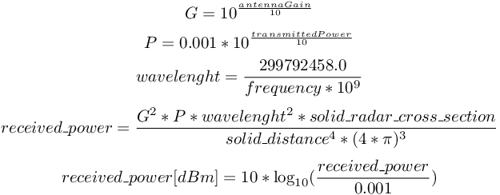

## Radar

Derived from [Device](device.md).

```
Radar {
  SFFloat    minRange                1
  SFFloat    maxRange               50.0
  SFFloat    horizontalFieldOfView   0.78
  SFFloat    verticalFieldOfView     0.1
  SFFloat    minAbsoluteRadialSpeed  0.0
  SFFloat    minRadialSpeed          1
  SFFloat    maxRadialSpeed         -1
  SFFloat    cellDistance            0.0
  SFFloat    cellSpeed               0.0
  SFFloat    rangeNoise              0.0
  SFFloat    speedNoise              0.0
  SFFloat    angularNoise            0.0
  SFFloat    antennaGain            20.0
  SFFloat    frequency              24.0
  SFFloat    transmittedPower        1.0
  SFFloat    minDetectableSignal    -100
  SFBool     occlusion             FALSE
}
```

### Description

The [Radar](#radar) node is used to model a radar sensor.

The [Radar](#radar) node can be used to measure other solids distance, angle,
and relative speed. Any [Solid](solid.md) node is a potential radar target if
its `radarCrossSection` field is bigger than 0.

#### WbRadarTarget

A radar target is defined by the following structure:

```c
typedef struct {
  double distance;
  double received_power;
  double speed;
  double azimuth;
} WbRadarTarget;
```

The `distance` is the radial distance between the radar and the target. The
`received_power` is the power received back by the radar from this target in dBm
(see the [returned power](#received-power) formulas). The `speed` is the speed
of the target relative to the radar sensor. The `azimuth` is the horizontal
angle of the target relative to the radar.

> **note** [C++]:
In C++ the name of the structure is `RadarTarget`.

> **note** [Java/Python]:
In Java and Python, the structure is replaced by a class called `RadarTarget`.

### Field Summary

- `minRange`: Defines the minimum range of the radar. Any object closer to the
radar than this value will not be seen.
- `maxRange`: Defines the maximum range of the radar. Any object farther to the
radar than this value will not be seen (even if the returned power is
sufficient).
- `horizontalFieldOfView`: Defines the horizontal field of view of the radar
detection frustum.
- `verticalFieldOfView`: Defines the vertical field of view of the radar detection
frustum.
- `minAbsoluteRadialSpeed`: Defines the minimum absolute radial speed (relative to
the radar) of the object to be considered as a target.
- `minRadialSpeed` and `maxRadialSpeed`: Defines the minimum and maximum radial
speed (relative to the radar) of the object to be visible. If both
`minRadialSpeed` and `maxRadialSpeed` are zero (the default), the radial speed
limits are deactivated.
- `cellDistance`: Defines the minimum radial distance between two targets for the
radar to be able to distinguish between them.
- `cellSpeed`: Defines the minimum radial speed difference between two targets for
the radar to be able to distinguish between them. A value of 0 means the speed
is not used to distinguish objects but only the distance.
- `rangeNoise`: Defines the gaussian noise of the distance measurements.
- `speedNoise`: Defines the gaussian noise of the speed measurements.
- `angularNoise`: Defines the gaussian noise of the angle measurements.
- `antennaGain`: Defines the gain of the antenna in dBi.
- `frequency`: Defines the frequency of the radar in Ghz.
- `transmittedPower`: Defines the power transmitted by the radar in dBm.
- `minDetectableSignal`: Defines the minimum detectable power in dBm. A returned
power lower than this threshold will not produce any target.
- `occlusion`: Defines if occlusions between the object and the radar should be
checked before generating a target. This feature can become computationally
expensive as the number of targets increase.

### Target detection

For each [Solid](solid.md) node having a `radarCrossSection` greater than 0, the
following pseudo code is used to compute if a new target should be generated:

```
if (a part of the solid is closer to the radar than maxRange) {
  if (a part of the solid is farther from the radar than minRange) {
    if (object is in the radar detection frustum defined by horizontalFieldOfView and verticalFieldOfView) {
      compute relative radial speed
      if (minRadialSpeed < speed < maxRadialSpeed and abs(speed) > minAbsoluteRadialSpeed) {
        compute returned power
        if (returned power > minDetectableSignal)
          create target
      }
    }
  }
}
if (target created) {
  if (cellSpeed <= 0 and target is closer to another target than cellDistance)
    merge both targets
  else if (cellSpeed > cellSpeed and speed difference between the two target < cellSpeed) {
    if (target is closer to another target than cellDistance)
      merge both targets
  }
}
```

The power returned by the target is computed using the following formulas:

%figure "Received power"



%end

### Radar Functions

**Name**

**wb\_radar\_enable**, **wb\_radar\_disable**, **wb\_radar\_get\_sampling\_period** - *enable and disable radar updates*

{[C++](cpp-api.md#cpp_radar)}, {[Java](java-api.md#java_radar)}, {[Python](python-api.md#python_radar)}, {[Matlab](matlab-api.md#matlab_radar)}, {[ROS](ros-api.md)}

``` c
#include <webots/radar.h>

void wb_radar_enable(WbDeviceTag tag, int ms)
void wb_radar_disable(WbDeviceTag tag)
int wb_radar_get_sampling_period(WbDeviceTag tag)
```

**Description**

`wb_radar_enable()` allows the user to enable a radar update each `ms`
milliseconds.
The provided `ms` argument specifies the sensor's sampling period.
Note that the first measurement will be available only after the first sampling period elapsed.

`wb_radar_disable()` turns the radar off, saving computation time.

The `wb_radar_get_sampling_period()` function returns the period given into the
`wb_radar_enable()` function, or 0 if the device is disabled.

---

**Name**

**wb\_radar\_get\_min\_range**, **wb\_radar\_get\_max\_range** - *get the minimum and maximum range of the radar*

{[C++](cpp-api.md#cpp_radar)}, {[Java](java-api.md#java_radar)}, {[Python](python-api.md#python_radar)}, {[Matlab](matlab-api.md#matlab_radar)}, {[ROS](ros-api.md)}

``` c
#include <webots/radar.h>

double wb_radar_get_min_range(WbDeviceTag tag)
double wb_radar_get_max_range(WbDeviceTag tag)
```

**Description**

These functions allow the controller to get the value of the minimum and maximum
range of the radar.

---

**Name**

**wb\_radar\_get\_horizontal\_fov**, **wb\_radar\_get\_vertical\_fov** - *get the horizontal and vertical field of view of the radar*

{[C++](cpp-api.md#cpp_radar)}, {[Java](java-api.md#java_radar)}, {[Python](python-api.md#python_radar)}, {[Matlab](matlab-api.md#matlab_radar)}, {[ROS](ros-api.md)}

``` c
#include <webots/radar.h>

double wb_radar_get_horizontal_fov(WbDeviceTag tag)
double wb_radar_get_vertical_fov(WbDeviceTag tag)
```

**Description**

These functions allow the controller to get the value of the horizontal and
vertical field of view of the radar.

---

**Name**

**wb\_radar\_get\_number\_of\_targets** - *get the current number of targets*

{[C++](cpp-api.md#cpp_radar)}, {[Java](java-api.md#java_radar)}, {[Python](python-api.md#python_radar)}, {[Matlab](matlab-api.md#matlab_radar)}, {[ROS](ros-api.md)}

``` c
#include <webots/radar.h>

int wb_radar_get_number_of_targets(WbDeviceTag tag)
```

**Description**

This function allows the controller to get the number of targets currently seen
by the radar.

---

**Name**

**wb\_radar\_get\_targets** - *get the targets array*

{[C++](cpp-api.md#cpp_radar)}, {[Java](java-api.md#java_radar)}, {[Python](python-api.md#python_radar)}, {[Matlab](matlab-api.md#matlab_radar)}, {[ROS](ros-api.md)}

``` c
#include <webots/radar.h>

const WbRadarTarget * wb_radar_get_targets(WbDeviceTag tag)
```

**Description**

This function returns the targets array. The size of the array can be get using
the function `wb_radar_get_number_of_targets`.
