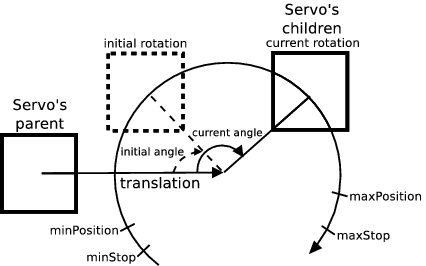
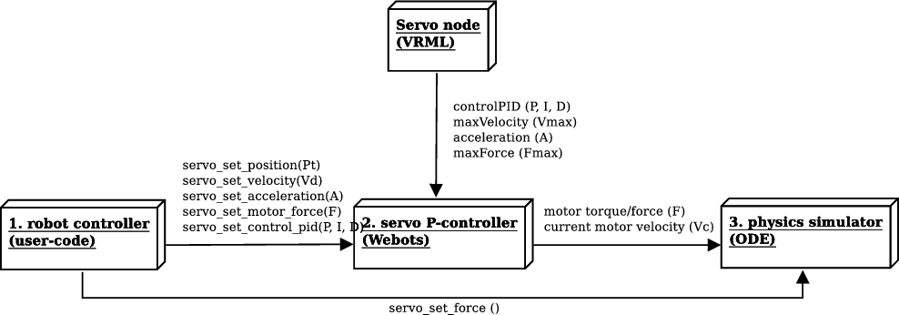
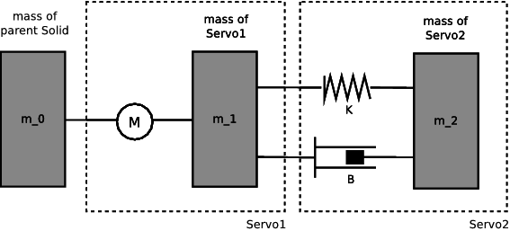

## Servo

> **note**:
As of Webots 7.2.0, the [Servo](#servo) node is deprecated and should not be
used in any new simulation models. It is kept for backwards compatibility only.
The functionality of the [Servo](#servo) node is replaced by the one provided by
the [HingeJoint](hingejoint.md), [RotationalMotor](rotationalmotor.md) and
[LinearMotor](linearmotor.md) nodes. Therefore, you should use these nodes
instead of the [Servo](#servo) node.

Derived from [Device](device.md).

```
Servo {
  SFString   type             "rotational"
  SFFloat    maxVelocity      10      # (0,inf)
  SFFloat    maxForce         10      # [0,inf)
  SFFloat    controlP         10      # (0,inf)
  SFFloat    acceleration     -1      # -1 or (0,inf)
  SFFloat    position         0
  SFFloat    minPosition      0       # (-inf,0]
  SFFloat    maxPosition      0       # [0,inf)
  SFFloat    minStop          0       # [-pi,0]
  SFFloat    maxStop          0       # [0,pi]
  SFFloat    springConstant   0       # [0,inf)
  SFFloat    dampingConstant  0       # [0,inf)
  SFFloat    staticFriction   0       # [0,inf)
}
```

### Description

A [Servo](#servo) node is used to add a joint (1 degree of freedom (DOF)) in a
mechanical simulation. The joint can be active or passive; it is placed between
the parent and children nodes (".wbt" hierarchy) of the [Servo](#servo) and
therefore it allows the children to move with respect to the parent. The
[Servo](#servo) can be of type "rotational" or "linear". A "rotational"
[Servo](#servo) is used to simulate a rotating motion, like an electric motor or
a hinge. A "linear" [Servo](#servo) is used to simulate a sliding motion, like a
linear motor, a piston, a hydraulic/pneumatic cylinder, a spring, or a damper.

### Field Summary

- The `type` field is a string which specifies the [Servo](#servo) type, and may
be either "rotational" (default) or "linear".
- The `maxVelocity` field specifies both the upper limit and the default value for
the servo *velocity*. The *velocity* can be changed at run-time with the
`wb_servo_set_velocity()` function. The value should always be positive (the
default is 10).
- The `maxForce` field specifies both the upper limit and the default value for
the servo *motor force*. The *motor force* is the torque/force that is available
to the motor to perform the requested motions. The `wb_servo_set_motor_force()`
function can be used to change the *motor force* at run-time. The value of
`maxForce` should always be zero or positive (the default is 10). A small
`maxForce` value may result in a servo being unable to move to the target
position because of its weight or other external forces.
- The `controlP` field specifies the initial value of the *P* parameter, which is
the *proportional gain* of the servo P-controller. A high *P* results in a large
response to a small error, and therefore a more sensitive system. Note that by
setting *P* too high, the system can become unstable. With a small *P*, more
simulation steps are needed to reach the target position, but the system is more
stable. The value of *P* can be changed at run-time with the
`wb_servo_set_control_p()` function.
- The `acceleration` field defines the default acceleration of the P-controller. A
value of -1 (infinite) means that the acceleration is not limited by the
P-controller. The acceleration can be changed at run-time with the
`wb_servo_set_acceleration()` function.
- The `position` field represents the current *position* of the [Servo](#servo),
in radians or meters. For a "rotational" servo, `position` represents the
current rotation angle in radians. For a "linear" servo, `position` represents
the magnitude of the current translation in meters.
- The `minPosition` and `maxPosition` fields specify *soft limits* for the target
position. These fields are described in more detail in the "Servo Limits"
section, see below.
- The `minStop` and `maxStop` fields specify the position of physical (or
mechanical) stops. These fields are described in more detail in the "Servo
Limits" section, see below.
- The `springConstant` and `dampingConstant` fields allow the addition of spring
and/or damping behavior to the [Servo](#servo). These fields are described in
more detail in the "Springs and Dampers" section, see below.
- The `staticFriction` allows to add a friction opposed to the [Servo](#servo)
movement. This field is described in more detail in the "Friction" section, see
below.

### Units

Rotational servos units are expressed in *radians* while linear servos units are
expressed in *meters*. See [this table](#servo-units):

%figure "Servo Units"

|              | Rotational                   | Linear                    |
| ------------ | ---------------------------- | ------------------------- |
| Position     | rad (radians)                | m (meters)                |
| Velocity     | rad/s (radians / second)     | m/s (meters / second)     |
| Acceleration | rad/s^2 (radians / second^2) | m/s^2 (meters / second^2) |
| Torque/Force | N*m (Newtons * meters)       | N (Newtons)               |

%end

### Initial Transformation and Position

The [Servo](#servo) node inherits the `translation` and `rotation` fields from
the [Transform](transform.md) node. These two fields represent the initial
coordinate system transformation between the [Servo](#servo) parent and
children.

In a "rotational" [Servo](#servo), these fields have the following meaning: The
`translation` field specifies the translation of the axis of rotation. The
`rotation` field specifies the orientation of the axis of rotation. See [this
figure](#rotational-servo).

%figure "Rotational servo"



%end

In a "linear" [Servo](#servo), these fields have the following meaning: The
`translation` field specifies the translation of the sliding axis. The
`rotation` field specifies the direction of the sliding axis. See [this
figure](#linear-servo).

%figure "Linear servo"


%end

The `position` field represents the current angle difference (in radians) or the
current distance (in meters) with respect to the initial `translation` and
`rotation` of the [Servo](#servo). If `position` field is zero then the
[Servo](#servo) is at its initial `translation` and `rotation`. For example if
we have a "rotational" [Servo](#servo) and the value of the `position` field is
1.5708, this means that this [Servo](#servo) is 90 degrees from its initial
rotation. The values passed to the `wb_servo_set_position()` function are
specified with respect to the position zero. The values of the `minPosition`,
`maxPosition`, `minStop` and `maxStop` fields are also defined with respect to
the position zero.

### Position Control

The standard way of operating a [Servo](#servo) is to control the position
directly (*position control*). The user specifies a target position using the
`wb_servo_set_position()` function, then the P-controller takes into account the
desired velocity, acceleration and motor force in order to move the servo to the
target position. See [this table](#servo-control-summary).

In Webots, position control is carried out in three stages, as depicted in [this
figure](#servo-control). The first stage is performed by the user-specified
controller (1) that decides which position, velocity, acceleration and motor
force must be used. The second stage is performed by the servo P-controller (2)
that computes the current velocity of the servo *V<sub>c</sub>*. Finally, the
third stage (3) is carried out by the physics simulator (ODE joint motors).

%figure "Servo control"



%end

At each simulation step, the P-controller (2) recomputes the current velocity
*Vc* according to the following algorithm:

```
Vc = P * (Pt - Pc);
if (abs(Vc) > Vd)
  Vc = sign(Vc) * Vd;
if (A != -1) {
  a = (Vc - Vp) / ts;
  if (abs(a) > A)
    a = sign(a) * A;
  Vc = Vp + a * ts;
}
```

where  *V<sub>c</sub>* is the current servo velocity in rad/s or m/s, *P* is the
P-control parameter specified in `controlP` field or set with
`wb_servo_set_control_p()`, *P<sub>t</sub>* is the *target position* of the
servo set by the function `wb_servo_set_position()`, *P<sub>c</sub>* is the
current servo position as reflected by the `position` field, *V<sub>d</sub>* is
the desired velocity as specified by the `maxVelocity` field (default) or set
with `wb_servo_set_velocity()`, *a* is the acceleration required to reach *Vc*
in one time step, *V<sub>p</sub>* is the motor velocity of the previous time
step, *t<sub>s</sub>* is the duration of the simulation time step as specified
by the `basicTimeStep` field of the [WorldInfo](worldinfo.md) node (converted in
seconds), and *A* is the acceleration of the servo motor as specified by the
`acceleration` field (default) or set with `wb_servo_set_acceleration()`.

### Velocity Control

The servos can also be used with *velocity control* instead of *position
control*. This is obtained with two function calls: first the
`wb_servo_set_position()` function must be called with `INFINITY` as a position
parameter, then the desired velocity, which may be positive or negative, must be
specified by calling the `wb_servo_set_velocity()` function. This will initiate
a continuous servo motion at the desired speed, while taking into account the
specified acceleration and motor force. Example:

```
wb_servo_set_position(servo, INFINITY);
wb_servo_set_velocity(servo, 6.28);  // 1 rotation per second
```

`INFINITY` is a C macro corresponding to the IEEE 754 floating point standard.
It is implemented in the C99 specifications as well as in C++. In Java, this
value is defined as `Double.POSITIVE_INFINITY`. In Python, you should use
`float('inf')`. Finally, in Matlab you should use the `inf` constant.

### Force Control

The position/velocity control described above are performed by the Webots
P-controller and ODE's joint motor implementation (see ODE documentation). As an
alternative, Webots does also allow the user to directly specify the amount of
torque/force that must be applied by a [Servo](#servo). This is achieved with
the `wb_servo_set_force()` function which specifies the desired amount of
torque/forces and switches off the P-controller and motor force. A subsequent
call to `wb_servo_set_position()` restores the original *position control*. Some
care must be taken when using *force control*. Indeed the torque/force specified
with `wb_servo_set_force()` is applied to the [Servo](#servo) continuously.
Hence the [Servo](#servo) will infinitely accelerate its rotational or linear
motion and eventually *explode* unless a functional force control algorithm is
used.

%figure "Servo Control Summary"

|                                | position control                 | velocity control                 | force control                         |
| ------------------------------ | -------------------------------- | -------------------------------- | ------------------------------------- |
| uses P-controller              | yes                              | no                               | no                                    |
| wb\_servo\_set\_position()     | * specifies the desired position | should be set to INFINITY        | switches to position/velocity control |
| wb\_servo\_set\_velocity()     | specifies the max velocity       | * specifies the desired velocity | is ignored                            |
| wb\_servo\_set\_acceleration() | specifies the max acceleration   | specifies the max acceleration   | is ignored                            |
| wb\_servo\_set\_motor\_force() | specifies the available force    | specifies the available force    | specifies the max force               |
| wb\_servo\_set\_force()        | switches to force control        | switches to force control        | * specifies the desired force         |

%end

### Servo Limits

The `position` field is a scalar value that represents the current servo
"rotational" or "linear" position. For a rotational servo, `position` represents
the difference (in radians) between the initial and the current angle of its
rotation field. For a linear servo, `position` represents the distance (in
meters) between the servo's initial and current translation (`translation`
field).

The `minPosition` and `maxPosition` fields define the *soft limits* of the
servo. Soft limits specify the *software* boundaries beyond which the
P-controller will not attempt to move. If the controller calls
`wb_servo_set_position()` with a target position that exceeds the soft limits,
the desired target position will be clipped in order to fit into the soft limit
range. Since the initial position of the servo is always zero, `minPosition`
must always be negative or zero, and `maxPosition` must always be positive or
zero. When both `minPosition` and `maxPosition` are zero (the default), the soft
limits are deactivated. Note that the soft limits can be overstepped when an
external force which exceeds the motor force is applied to the servo. For
example, it is possible that the weight of a robot exceeds the motor force that
is required to hold it up.

The `minStop` and `maxStop` fields define the *hard limits* of the servo. Hard
limits represent physical (or mechanical) bounds that cannot be overrun by any
force. Hard limits can be used, for example, to simulate both end caps of a
hydraulic or pneumatic piston or to restrict the range of rotation of a hinge.
The value of `minStop` must be in the range [-π, 0] and `maxStop` must be in
the range [0, π]. When both `minStop` and `maxStop` are zero (the default), the
hard limits are deactivated. The servo hard limits use ODE joint stops (for more
information see the ODE documentation on `dParamLoStop` and `dParamHiStop`).

Finally, note that when both soft and hard limits are activated, the range of
the soft limits must be included in the range of the hard limits, such that
`minStop <= minValue` and `maxStop>= maxValue`.

### Springs and Dampers

The `springConstant` field specifies the value of the spring constant (or spring
stiffness), usually denoted as *K*. The `springConstant` must be positive or
zero. If the `springConstant` is zero (the default), no spring torque/force will
be applied to the servo. If the `springConstant` is greater than zero, then a
spring force will be computed and applied to the servo in addition to the other
forces (i.e., motor force, damping force). The spring force is calculated
according to Hooke's law: *F = -Kx*, where *K* is the `springConstant` and *x*
is the current servo position as represented by the `position` field. Therefore,
the spring force is computed so as to be proportional to the current servo
position, and to move the servo back to its initial position. When designing a
robot model that uses springs, it is important to remember that the spring's
resting position for each servo will correspond to the initial position of the
servo.

The `dampingConstant` field specifies the value of the servo damping constant.
The value of `dampingConstant` must be positive or zero. If `dampingConstant` is
zero (the default), no damping torque/force will be added to the servo. If
`dampingConstant` is greater than zero, a damping torque/force will be applied
to the servo in addition to the other forces (i.e., motor force, spring force).
This damping torque/force is proportional to the effective servo velocity: *F =
-Bv*, where *B* is the damping constant, and *v = dx/dt* is the effective servo
velocity computed by the physics simulator.

%figure "Mechanical Diagram of a Servo"


%end

As you can see in (see  [this figure](#mechanical-diagram-of-a-servo)), a
[Servo](#servo) creates a joint between two masses *m<sub>0</sub>* and
*m<sub>1</sub>*. *m<sub>0</sub>* is defined by the [Physics](physics.md) node in
the parent of the [Servo](#servo). The mass *m<sub>1</sub>* is defined by the
[Physics](physics.md) node of the [Servo](#servo). The value *x<sub>0</sub>*
corresponds to the initial translation of the [Servo](#servo) defined by the
`translation` field. The position *x* corresponds to the current position of the
[Servo](#servo) defined by the `position` field.

### Servo Forces

Altogether, three different forces can be applied to a [Servo](#servo): the
motor force, the spring force and the damping force. These three forces are
applied in parallel and can be switched on and off independently (by default
only the motor force is on). For example, to turn off the motor force and obtain
a passive [Servo](#servo), you can set the `maxForce` field to zero.

%figure "Servo forces summary"

| Force                       | motor force    | spring force         | damping force         |
| --------------------------- | -------------- | -------------------- | --------------------- |
| Turned on when:             | maxForce `>` 0 | springConstant `>` 0 | dampingConstant `>` 0 |
| Turned off when:            | maxForce = 0   | springConstant = 0   | dampingConstant = 0   |
| regular motor (the default) | on             | off                  | off                   |
| regular spring & damper     | off            | on                   | on                    |
| damper (without spring)     | off            | off                  | on                    |
| motor with friction         | on             | off                  | on                    |
| spring without any friction | off            | on                   | off                   |

%end

To obtain a spring & damper element, you can set `maxForce` to zero and
`springConstant` and `dampingConstant` to non-zero values. A pure spring is
obtained when both `maxForce` and `dampingConstant` but not `springConstant` are
set to zero. However in this case the spring may oscillate forever because
Webots will not simulate the air friction. So it is usually wise to associate
some damping to every spring.

### Friction

The friction applied on the [Servo](#servo) to slow down its velocity is
computed as the maximum between the `maxForce` and the `staticFriction` values.
The static friction is particularily useful to add a friction for a passive
[Servo](#servo).

### Serial Servos

Each instance of a [Servo](#servo) simulates a mechanical system with optional
motor, spring and damping elements, mounted in parallel. Sometimes it is
necessary to have such elements mounted serially. With Webot, serially mounted
elements must be modeled by having [Servo](#servo) nodes used as children of
other [Servo](#servo) nodes. For example if you wish to have a system where a
motor controls the resting position of a spring, then you will need two
[Servo](#servo) nodes, as depicted in [this
figure](#example-of-serial-connection-of-two-servo-nodes). In this example, the
parent [Servo](#servo) will have a motor force (maxForce > 0) and the child
[Servo](#servo) will have spring and damping forces (`springConstant` > 0 and
`dampingConstant` > 0).

%figure "Example of serial connection of two Servo nodes"



%end

This is equivalent to this ".wbt" code, where, as you can notice, *Servo2* is a
child of *Servo1*:

```
DEF Servo1 Servo {
  ...
  children [
    DEF Servo2 Servo {
      ...
      children [
        ...
      ]
      boundingObject ...
      physics Physics {
        mass {m2}
      }
      maxForce 0
      springConstant {K}
      dampingConstant {B}
    }
  ]
  boundingObject ...
  physics Physics {
    mass {m1}
  }
  maxForce {M}
  springConstant 0
  dampingConstant 0
}
```

Note that it is necessary to specify the [Physics](physics.md) and the
`boundingObject` of *Servo1*. This adds the extra body *m<sub>1</sub>* in the
simulation, between the motor and the spring and damper.

### Simulating Overlayed Joint Axes

Sometimes it is necessary to simulate a joint with two or three independent but
overlayed rotation axes (e.g., a shoulder joint with a *pitch* axis and a *roll*
axis). As usually with Webots, each axis must be implemented as a separate
[Servo](#servo) node. So for two axes you need two [Servo](#servo) nodes, for
three axes you need three [Servo](#servo) nodes, etc.

With overlayed axes (or very close axes) the mass and the shape of the body
located between these axes is often unknown or negligible. However, Webots
requires all the intermediate `boundingObject` and `physics` fields to be
defined. So the trick is to use dummy values for these fields. Usually the dummy
`boundingObject` can be specified as a [Sphere](sphere.md) with a radius of 1
millimeter. A [Sphere](sphere.md) is the preferred choice because this is the
cheapest shape for the collision detection. And the `physics` field can use a
[Physics](physics.md) node with default values.

This is better explained with an example. Let's assume that we want to build a
pan/tilt robot head. For this we need two independent (and perpendicular)
rotation axes: *pan* and *tilt*. Now let's assume that these axes cross each
other but we don't know anything about the shape and the mass of the body that
links the two axes. Then this can be modeled like this:

```
DEF PAN Servo {
  ...
  children [
    DEF TILT Servo {
      translation 0 0 0  # overlayed
      children [
        DEF HEAD_TRANS Transform {
          # head shape
        }
        # head devices
      ]
      boundingObject USE HEAD_TRANS
      physics Physics {
      }
    }
  ]
  boundingObject DEF DUMMY_BO Sphere {
    radius 0.001
  }
  physics DEF DUMMY_PHYSICS Physics {
  }
}
```

Please note the dummy [Physics](physics.md) and the 1 millimeter
[Sphere](sphere.md) as dummy `boundingObject`.

### Servo Functions

**Name**

**wb\_servo\_set\_position**, **wb\_servo\_set\_velocity**, **wb\_servo\_set\_acceleration**, **wb\_servo\_set\_motor\_force**, **wb\_servo\_set\_control\_p**, **wb\_servo\_get\_min\_position**, **wb\_servo\_get\_max\_position** - *change the parameters of the P-controller*

{[C++](cpp-api.md#cpp_servo)}, {[Java](java-api.md#java_servo)}, {[Python](python-api.md#python_servo)}, {[Matlab](matlab-api.md#matlab_servo)}

``` c
#include <webots/servo.h>

void wb_servo_set_position(WbDeviceTag tag, double position)
double wb_servo_get_target_position(WbDeviceTag tag)
void wb_servo_set_velocity(WbDeviceTag tag, double velocity)
void wb_servo_set_acceleration(WbDeviceTag tag, double acceleration)
void wb_servo_set_motor_force(WbDeviceTag tag, double force)
void wb_servo_set_control_p(WbDeviceTag tag, double p)
double wb_servo_get_min_position(WbDeviceTag tag)
double wb_servo_get_max_position(WbDeviceTag tag)
```

**Description**

The `wb_servo_set_position()` function specifies a new target position that the
P-controller will attempt to reach using the current velocity, acceleration and
motor torque/force parameters. This function returns immediately (asynchronous)
while the actual motion is carried out in the background by Webots. The target
position will be reached only if the physics simulation allows it, that means,
if the specified motor force is sufficient and the motion is not blocked by
obstacles, external forces or the servo's own spring force, etc. It is also
possible to wait until the [Servo](#servo) reaches the target position
(synchronous) like this:

``` c
void servo_set_position_sync(WbDeviceTag tag, double target, int delay) {
  const double DELTA = 0.001;  // max tolerated difference
  wb_servo_set_position(tag, target);
  wb_servo_enable_position(tag, TIME_STEP);
  double effective;  // effective position
  do {
    wb_robot_step(TIME_STEP);
    delay -= TIME_STEP;
    effective = wb_servo_get_position(tag);
  }
  while (fabs(target - effective) > DELTA && delay > 0);
  wb_servo_disable_position(tag);
}
```

The `INFINITY` (*#include <math.h>*) value can be used as the second argument to
the `wb_servo_set_position()` function in order to enable an endless rotational
(or linear) motion. The current values for velocity, acceleration and motor
torque/force are taken into account. So for example, `wb_servo_set_velocity()`
can be used for controlling the velocity of the endless rotation:

``` c
// velocity control
wb_servo_set_position(tag, INFINITY);
wb_servo_set_velocity(tag, desired_speed);  // rad/s
```

> **note** [C++]:
In C++ use `std::numeric_limits<double>::infinity()` instead of INFINITY

<!-- -->

> **note** [Java]:
In Java use `Double.POSITIVE_INFINITY` instead of INFINITY

<!-- -->

> **note** [Python]:
In Python use `float('+inf')` instead of INFINITY

<!-- -->

> **note** [Matlab]:
In MATLAB use `inf` instead of INFINITY

The `wb_servo_get_target_position()` function allows the user to get the target
position. This value matches with the argument given to the last
`wb_servo_set_position()` function call.

The `wb_servo_set_velocity()` function specifies the velocity that servo should
reach while moving to the target position. In other words, this means that the
servo will accelerate (using the specified acceleration, see below) until the
target velocity is reached. The velocity argument passed to this function cannot
exceed the limit specified in the `maxVelocity` field.

The `wb_servo_set_acceleration()` function specifies the acceleration that the
P-controller should use when trying to reach the specified velocity. Note that
an infinite acceleration is obtained by passing -1 as the `acc` argument to this
function.

The `wb_servo_set_motor_force()` function specifies the max torque/force that
will be available to the motor to carry out the requested motion. The motor
torque/force specified with this function cannot exceed the value specified in
the `maxForce` field.

The `wb_servo_set_control_p()` function changes the value of the *P* parameter
in the P-controller. *P* is a parameter used to compute the current servo
velocity *V<sub>c</sub>* from the current position *P<sub>c</sub>* and target
position *P<sub>t</sub>*, such that *V<sub>c</sub><sub>t</sub><sub>c</sub>*.
With a small *P*, a long time is needed to reach the target position, while too
large a *P* can make the system unstable. The default value of *P* is specified
by the `controlP` field of the corresponding [Servo](#servo) node.

The `wb_servo_get_[min|max]_position()` functions allow to get the values of
respectively the `minPosition` and the `maxPosition` fields.

---

**Name**

**wb\_servo\_enable\_position**, **wb\_servo\_disable\_position**, **wb\_servo\_get\_position\_sampling\_period**, **wb\_servo\_get\_position** - *get the effective position of a servo*

{[C++](cpp-api.md#cpp_servo)}, {[Java](java-api.md#java_servo)}, {[Python](python-api.md#python_servo)}, {[Matlab](matlab-api.md#matlab_servo)}

``` c
#include <webots/servo.h>

void wb_servo_enable_position(WbDeviceTag tag, int ms)
void wb_servo_disable_position(WbDeviceTag tag)
int wb_servo_get_position_sampling_period(WbDeviceTag tag)
double wb_servo_get_position(WbDeviceTag tag)
```

**Description**

The `wb_servo_enable_position()` function activates position measurements for
the specified servo. A new position measurement will be performed each `ms`
milliseconds; the result must be obtained with the `wb_servo_get_position()`
function. The returned value corresponds to the most recent measurement of the
servo position. The `wb_servo_get_position()` function measures the *effective
position* of the servo which, under the effect of external forces, is usually
different from the *target position* specified with `wb_servo_set_position()`.
For a rotational servo, the returned value is expressed in radians, for a linear
servo, the value is expressed in meters. The returned value is valid only if the
corresponding measurement was previously enabled with
`wb_servo_enable_position()`.

The `wb_servo_disable_position()` function deactivates position measurements for
the specified servo. After a call to `wb_servo_disable_position()`,
`wb_servo_get_position()` will return undefined values.

The `wb_servo_get_position_sampling_period()` function returns the period given
into the `wb_servo_enable_position()` function, or 0 if the device is disabled.

---

**Name**

**wb\_servo\_enable\_motor\_force\_feedback**, **wb\_servo\_get\_motor\_force\_feedback**, **wb\_servo\_get\_motor\_force\_feedback\_sampling\_period**, **wb\_servo\_disable\_motor\_force\_feedback** - *get the motor force currently used by a servo*

{[C++](cpp-api.md#cpp_servo)}, {[Java](java-api.md#java_servo)}, {[Python](python-api.md#python_servo)}, {[Matlab](matlab-api.md#matlab_servo)}

``` c
#include <webots/servo.h>

void wb_servo_enable_motor_force_feedback(WbDeviceTag tag, int ms)
void wb_servo_disable_motor_force_feedback(WbDeviceTag tag)
int wb_servo_get_motor_force_feedback_sampling_period(WbDeviceTag tag)
double wb_servo_get_motor_force_feedback(WbDeviceTag tag)
```

**Description**

The `wb_servo_enable_motor_force_feedback()` function activates torque/force
feedback measurements for the specified servo. A new measurement will be
performed each `ms` milliseconds; the result must be retrieved with the
`wb_servo_get_motor_force_feedback()` function.

The `wb_servo_get_motor_force_feedback()` function returns the most recent motor
force measurement. This function measures the amount of motor force that is
currently being used by the servo in order to achieve the desired motion or hold
the current position. For a "rotational" servo, the returned value is a torque
[N*m]; for a "linear" servo, the value is a force [N]. The returned value is an
approximation computed by the physics engine, and therefore it may be
inaccurate. The returned value normally does not exceed the available motor
force specified with `wb_servo_set_motor_force()` (the default being the value
of the `maxForce` field). Note that this function measures the *current motor
force* exclusively, all other external or internal forces that may apply to the
servo are ignored. In particular, `wb_servo_get_motor_force_feedback()` does not
measure:

- The spring and damping forces that apply when the `springConstant` or
`dampingConstant` fields are non-zero.
- The force specified with the `wb_servo_set_force()` function.
- The *constraint forces* that restrict the servo motion to one degree of freedom
(DOF). In other words, the forces applied outside of the servo DOF are ignored.
Only the forces applied in the DOF are considered. For example, in a "linear"
servo, a force applied at a right angle to the sliding axis is completely
ignored. In a "rotational" servo, only the torque applied around the rotation
axis is considered.

Note that this function applies only to *physics-based* simulation. Therefore,
the `physics` and `boundingObject` fields of the [Servo](#servo) node must be
defined for this function to work properly.

If `wb_servo_get_motor_force_feedback()` was not previously enabled, the return
value is undefined.

The `wb_servo_get_motor_force_feedback_sampling_period()` function returns the
period given into the `wb_servo_enable_motor_force_feedback()` function, or 0 if
the device is disabled.

---

**Name**

**wb\_servo\_set\_force** - *direct force control*

{[C++](cpp-api.md#cpp_servo)}, {[Java](java-api.md#java_servo)}, {[Python](python-api.md#python_servo)}, {[Matlab](matlab-api.md#matlab_servo)}

``` c
#include <webots/servo.h>

void wb_servo_set_force(WbDeviceTag tag, double force)
```

**Description**

As an alternative to the P-controller, the `wb_servo_set_force()` function
allows the user to directly specify the amount of torque/force that must be
applied by a servo. This function bypasses the P-controller and ODE joint
motors; it adds the force to the physics simulation directly. This allows the
user to design a custom controller, for example a PID controller. Note that when
`wb_servo_set_force()` is invoked, this automatically resets the force
previously added by the P-controller.

In a "rotational" servo, the *force* parameter specifies the amount of torque
that will be applied around the servo rotation axis. In a "linear" servo, the
parameter specifies the amount of force [N] that will be applied along the
sliding axis. A positive *torque/force* will move the bodies in the positive
direction, which corresponds to the direction of the servo when the `position`
field increases. When invoking `wb_servo_set_force()`, the specified *force*
parameter cannot exceed the current *motor force* of the servo (specified with
`wb_servo_set_motor_force()` and defaulting to the value of the `maxForce`
field).

Note that this function applies only to *physics-based* simulation. Therefore,
the `physics` and `boundingObject` fields of the [Servo](#servo) node must be
defined for this function to work properly.

It is also possible, for example, to use this function to implement springs or
dampers with controllable properties. The example in
"projects/samples/howto/worlds/force\_control.wbt" demonstrates the usage of
`wb_servo_set_force()` for creating a simple spring and damper system.

---

**Name**

**wb\_servo\_get\_type** - *get the servo type*

{[C++](cpp-api.md#cpp_servo)}, {[Java](java-api.md#java_servo)}, {[Python](python-api.md#python_servo)}, {[Matlab](matlab-api.md#matlab_servo)}

``` c
#include <webots/servo.h>

int wb_servo_get_type(WbDeviceTag tag)
```

**Description**

This function allows the user to retrieve the servo type defined by the `type`
field. If the value of the `type` field is "linear", this function returns
WB\_SERVO\_LINEAR, and otherwise it returns WB\_SERVO\_ROTATIONAL.

%figure "Return values for the *wb_servo_get_type()* function"

| Servo.type   | return value          |
| ------------ | --------------------- |
| "rotational" | WB\_SERVO\_ROTATIONAL |
| "linear"     | WB\_SERVO\_LINEAR     |

%end

