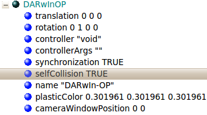

## Simulated devices

The simulation model is equiped with the following sensors and actuators:

- 20 servos
- LEDs (including 2 RGB ones)
- A 3 axes accelerometer
- A 3 axes gyroscope
- A camera
- A speaker

The accelerometer returns values between 0 and 1024 corresponding to values
between -3 [g] to +3 [g] like on the real robot. For the gyro, it returns also
values between 0 and 1024, corresponding to values between -1600 [deg/sec] and
+1600 [deg/sec], here again similarly to the values returned by the real robot.
Their respective names are `Accelerometer` and `Gyro`.

The speaker name is `Speaker` and it can be used to play sound files or perform text-to-speech.

The camera is a RGBA camera and has a basic resolution of 160x120 pixels, but it
can be changed to any value. The horizontal field of view is 1.0123 [rad].

Each of the 2 RBG LEDs, called `HeadLed` and `EyeLed`, is split in two separated
parts, one on the head of the robot and one other small part on the back panel
of the robot. There are also three other standard LEDs on the back panel of the
robot, they are called `BackLedGreen`, `BackLedBlue` and `BackLedRed`.

%figure "Names of the servo of the DARwIn-OP"

| ID | Name      | ID | Name      | ID | Name      | ID | Name      |
| -- | --------- | -- | --------- | -- | --------- | -- | --------- |
| 1  | ShoulderR | 2  | ShoulderL | 3  | ArmUpperR | 4  | ArmUpperL |
| 5  | ArmLowerR | 6  | ArmLowerL | 7  | PelvYR    | 8  | PelvYL    |
| 9  | PelvR     | 10 | PelvL     | 11 | LegUpperR | 12 | LegUpperL |
| 13 | LegLowerR | 14 | LegLowerL | 15 | AnkleR    | 16 | AnkleL    |
| 17 | FootR     | 18 | FootL     | 19 | Neck      | 20 | Head      |

%end

The corresponding position of each servo can be seen in figure
[Actuator](#position-of-the-servos). Each of the 20 servos has the following
configuration:

%figure "Configuration of the servo of the DARwIn-OP"

|                |      |        | | | | |  |
| --------------- | ----- | ------- |  |  |  |  |  |
| maxForce        | 2.5   | N*m     |
| acceleration    | 55    | rad/s^2 |
| maxVelocity     | 12.26 | rad/s   |
| dampingConstant | 0.002 |         |
| staticFriction  | 0.025 | N*m     |

%end

%figure "Position of the servos"

%end

For more information on the use of all of these sensors/actuators refer to the
[Reference Manual](http://www.cyberbotics.com/reference) of Webots.

The physical model is very realistic and self collision check is available. To
activate the self collision expand DARwIn-OP in the scene tree and set
selfCollision field to true (see figure
[selfCollision](#scene-tree-of-the-darwin-op)). Use the self collision check
only if you need it, because it is very computationally costly and can therefore
significantly slow down the simulation speed.

%figure "Scene tree of the DARwIn-OP"

%end
