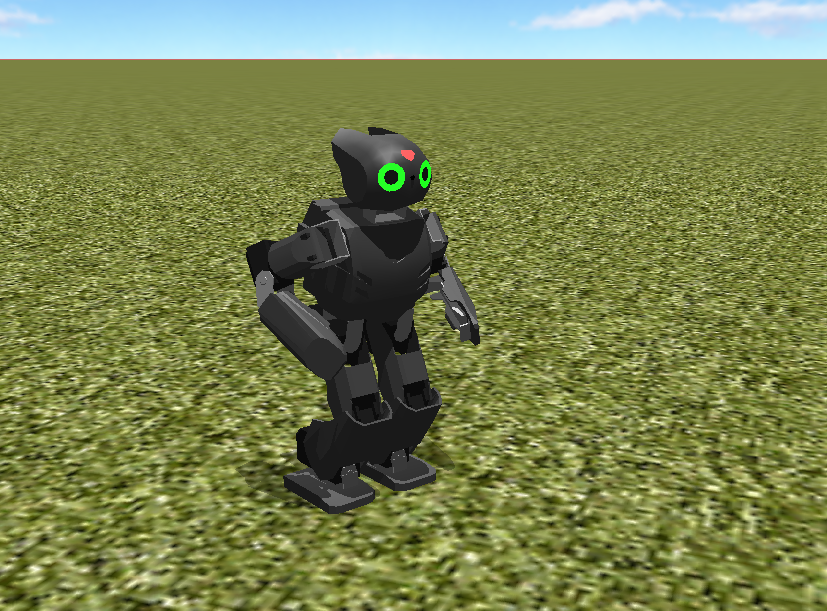

## Walk

This example illustrates the use of the gait and motion manager, the use of the
keyboard, and also the use of the accelerometer.

%figure "Walk example"

%end

At the beginning of the controller, the motion manager is used to make the robot
stand up, then the controller enters an infinite loop. The first thing done in
the loop is to check if the robot has not fallen down, this is achieved by using
the accelerometer. Then if the robot has fallen down, the motion manager is used
to make the robot to stand up. Then, the keyboard is read, if the space bar is
pressed the robot start/stop to walk. Then, the keys up/down/right/left are
pressed to make the robot turn and move forward/backward, several keys can be
pressed at the same time.

Try to add some more action by using more keys. You can for example use the
`NUMPAD\_LEFT` and `NUMPAD\_RIGHT` keys to make a left/right
shoot (page 13 and 12 in motion manager). You can also use normal keys like 'A'
instead if you prefer.

You can also use another key to make the robot walk quicker or slower (change
the XAmplitude sent to the gait manager, values must be between -1 and 1).

This example works in cross-compilation but you will need to connect a USB
keyboard to the robot. Otherwise, it is recommended to test this example with
the remote control in order to use the computer's keyboard instead.

This example can also be used to explore and test all the parameters of the
gait.
