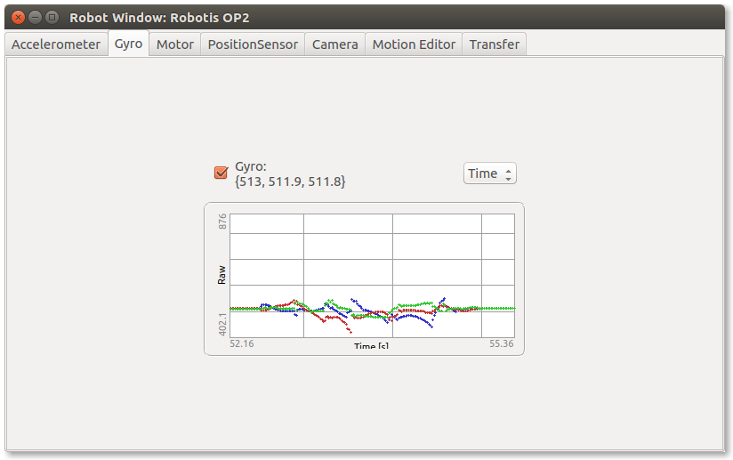

## Gyro

This tab is very similar to the accelerometer tab but addresses the gyro. If the
checkbox is checked, the values of the gyro are shown and plotted on the graph
in real time. Here again four different types of graph can be plot.

%figure "Gyro tab of the robot-window"

%end
