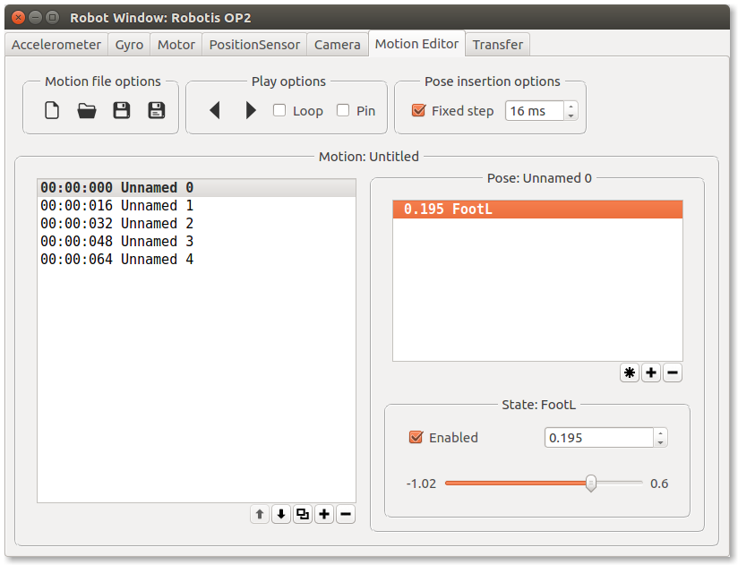

## Motion editor

This tab allows you to create, edit or play a motion file. It contains an animation
which can be executed by the robot at any time.

%figure "Motion editor tab of the Robot Window"

%end

The motion is composed of multiple poses (Left pane).
A pose is an instant in the time the robot has to follow.
The robot will smoothly move from one pose to the next one.

A pose is composed of multiple states (Right pane). A state represent a position of one motor.
If the state is enabled, it means that the motor should have the set position at
the pose instant time.
