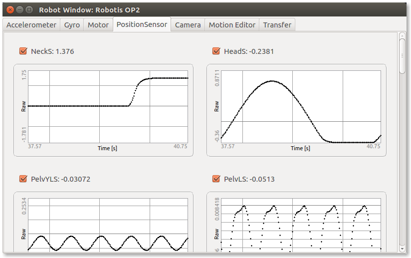

## Position Sensors

This tab can be used to see the state of each position sensor.
The use of each sensor in the robot window can separately be set by checking/unchecking the corresponding checkbox.
If the checkbox is checked, the value of the sensor is shown and plotted in function of the time.

%figure "Position sensor tab of the robot window"

%end
