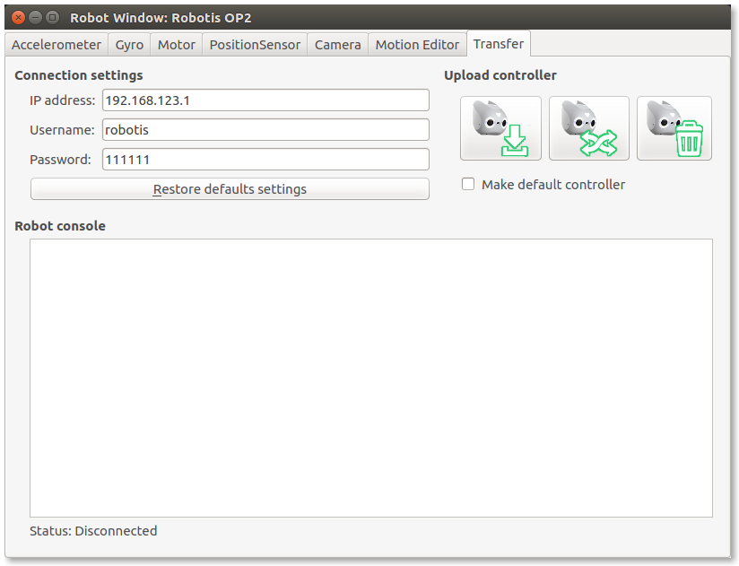

## Settings

To send your controller to the real robot and make it run on it, go to the
`Transfer` tab of the robot window (figure
[Transfer tab](#transfer-tab-of-the-robot-window)).

%figure "Transfer tab of the robot window"

%end

The first thing to do is to set the connections settings. The first setting is
the IP address of the robot. If you use an Ethernet cable to connect to the
robot, the IP address is 192.168.123.1. But if you use a wifi connection with
the robot the address is not fixed, to know it, execute the `ifconfig` command
on the robot, the IP address is the `inet addr` of wlan0 (warning, the address
can sometimes change without any specific reason).

The second parameter is the username with which you log-on on the robot, if you
do not have explicitly
changed it, the username is `robotis`.

>**Note**: The default username of DARwIn-OP robot is `darwin`.

Finally the last parameter is the password corresponding to the username.
Here again, if you do not have explicitly changed
it, the password is `111111`. Each time you successfully connect,
all settings are saved so that it is not necessary to set them each time you
start the program. If you want to restore the default parameters of the
connection, just click on the `Restore default settings` button (Alt+r).

Before you can send your controller to the real robot you have to change the
`Makefile.robotis-op2` file to suit to your project. If you have added new files to
the project, do not forget to add them to the `CXX_SOURCES` and if you have
changed the project name, change also the `TARGET` value.

Before to send the controller you will also need to complete the `Robot Config`
section of the `config.ini` file. You have two parameters to fill in:

- `Time step` The time step in milliseconds must be specified in the field
`time_step`, a minimal time step of 16ms is requested, if no time step (or a
time step smaller than 16ms) is set, the default time step of 16ms is used.
Warning: Depending on the complexity of you controller, a time step of 16ms can
not always be respected. For example using the camera or the manager can slow
done the speed, so enable them only if you really need them.
- `Camera resolution` The horizontal and vertical resolution of the camera must be
set in the fields `camera_width` and `camera_height`. Only the resolutions
specified in the following table are supported, if another
resolution is set, the default resolution of 320x240 will be used.

%figure "Camera resolutions supported by the camera of the ROBOTIS OP2"

| Width [pixel] | Height [pixel] | FPS  |
| ------------- | -------------- | ---- |
| 320           | 240            | 30   |
| 640           | 360            | 30   |
| 640           | 400            | 30   |
| 640           | 480            | 30   |
| 768           | 480            | 28   |
| 800           | 600            | 22.5 |

%end
