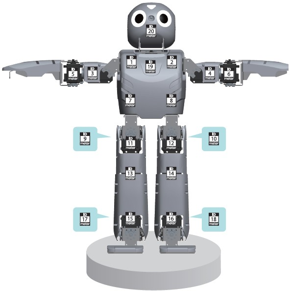

## Simulated devices

The simulation model is equiped with the following sensors and actuators:

- 20 servos
- 5 LEDs (including 2 RGB ones)
- A 3-axes accelerometer
- A 3-axes gyroscope
- A camera
- A speaker

### Servos

Servo positions and identifiers can be found in the following
[figure](#position-of-the-servos).

%figure "Position of the servos"

%end

Mapping between identifiers and names can be found in following table.

%figure "Identifiers to name mapping for Robotis OP2 servos"

| ID | Name      | ID | Name      | ID | Name      | ID | Name      |
| -- | --------- | -- | --------- | -- | --------- | -- | --------- |
| 1  | ShoulderR | 2  | ShoulderL | 3  | ArmUpperR | 4  | ArmUpperL |
| 5  | ArmLowerR | 6  | ArmLowerL | 7  | PelvYR    | 8  | PelvYL    |
| 9  | PelvR     | 10 | PelvL     | 11 | LegUpperR | 12 | LegUpperL |
| 13 | LegLowerR | 14 | LegLowerL | 15 | AnkleR    | 16 | AnkleL    |
| 17 | FootR     | 18 | FootL     | 19 | Neck      | 20 | Head      |

%end

Each of the 20 servos has the following configuration.

%figure "Standard servo configuration"
|                 |       |         |
| --------------- | ----- | ------- |
| maxForce        | 2.5   | N*m     |
| acceleration    | 55    | rad/s^2 |
| maxVelocity     | 12.26 | rad/s   |
| dampingConstant | 0.002 |         |
| staticFriction  | 0.025 | N*m     |
%end

### LEDs

The two RGB LEDs are placed on the robot head. They are called `HeadLed` and
`EyeLed`. The two eyes will have same color. Note that these LEDs are
replicated on the robot back panel.

The three other LEDs are unicolor and placed on the robot back.
They are called `BackLedGreen`, `BackLedBlue` and `BackLedRed`.

### Accelerometer

The accelerometer returns values between 0 and 1024 corresponding to values
between -3 [g] to +3 [g] like on the real robot.
The Webots device simulating it is called `Accelerometer`.

### Gyroscope

The gyroscope returns values between 0 and 1024, corresponding to values between
 -1600 [deg/sec] and +1600 [deg/sec], similarly to the values returned by the real robot.
The Webots device simulating it is called `Gyro`.

### Camera

The camera is a RGBA camera. It has a default resolution of 160x120 pixels, but it
can be changed to any value.
The horizontal field of view is 1.0123 [rad].

### Speaker

The Webots device simulating a speaker is named `Speaker`. It can be used to play sound files or perform
text-to-speech.

### More information

For more information on the use of all of these sensors/actuators refer to the
[Reference Manual](http://www.cyberbotics.com/reference) of Webots.

The physical model is very realistic and self collision check is available. To
activate the self collision expand the Robotis OP2 node in the scene tree and set
`selfCollision` field to `true`. Use the self collision check
only if you need it, because it is an expensive computation feature and can therefore
significantly slow down the simulation speed.
