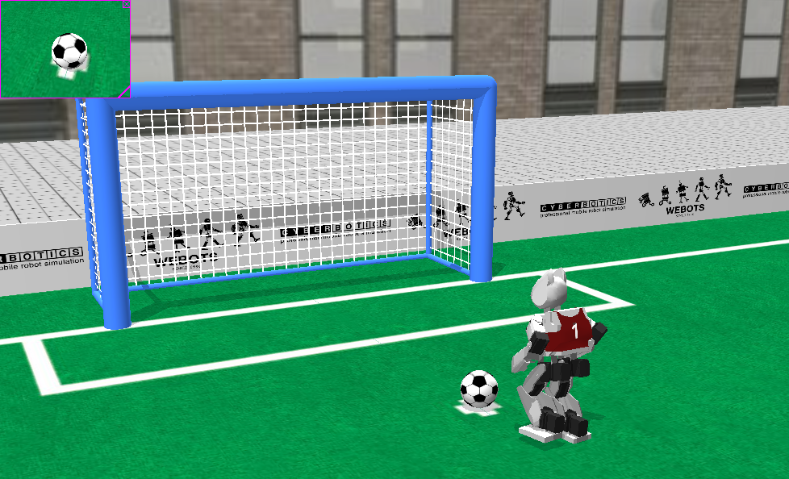

## Soccer

This is a very complete example which used the three managers and almost all of the sensors.

%figure "Soccer example"

%end

The controller is a very simple soccer player.
It relies on most of the tools used in previous examples.
We recommend you to study it by yourself and of course to improve it.

To extend this controller you can add new files to the project, but do not forget to also add them to the makefile (add the cpp files to the `CXX_SOURCES` section).
This example is also a good starting point for developing a more complicated controller.

This example works in remote compilation.
But we recommend you to test it on a soft ground and away from any source of danger (stairs, hot surface, etc.), because the robot will move a lot and it is not excluded that it will fall down from time to time.
