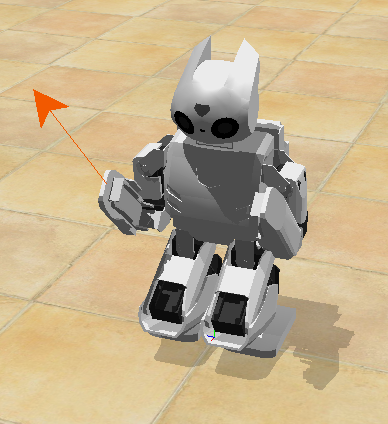

## Symmetry

This example is very basic and explains the use of the motors.

%figure "Symmetry example"



%end

It starts by setting the motor force of the three motors of the right arm to zero in order to completely release this arm.
Then, in an infinite loop, the position of the previous three motors is read and displayed.
Finally, still in the loop, the opposite position of each motor of the right arm is applied to the corresponding motor of the left arm in order to mimic the motion of the right arm.

You are now able to move the right arm which is free in simulation: select the robot, then press Ctrl+Alt and left click on the arm, then without releasing the left button move the mouse.
This will apply a force (symbolized by an arrow) which will make the arm move.
Note that it is very important to enable the position sensors in order to read motor positions.
In this example, this is done in the constructor.

You can also try to add an oscillation of the head, by adding this in your main loop:

```cpp
mMotors[18]->setPosition(sin(getTime()));
```

Then save the file, press the build button and finally revert the simulation to start the new controller.
This example is well suited for the remote compilation and we recommended that you start by testing the remote compilation tool by using this example.
