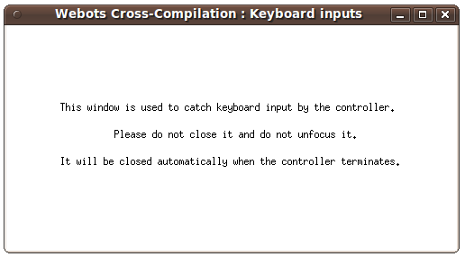

## Using Keyboard

The use of the keyboard is also available in remote compilation.
To use a keyboard you just have to connect an USB keyboard to the robot to one of the two USB ports available on the back of the robot (any wireless keyboard will also works).

Then when enabling the keyboard in your controller, a small window like the one depicted on this [figure](#small-window-used-to-capture-the-keyboard-inputs-in-cross-compilation) will show up on the real robot screen (if any connected).

%figure "Small window used to capture the keyboard inputs in cross-compilation"

%end

This little window is used to capture the input of the keyboard.
Please do not close this window or unset the focus on it (by clicking outside this window) or you wont be able to read the keyboard input anymore.
