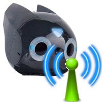
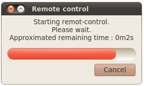

## Using remote control from Robot Window

To use remote control, open the Robot Window, go to the `Transfer` tab, as for
remote compilation you have to set the connection settings (see
[previous chapter](settings.md) for more information). To start the remote
control, stop and revert your simulation, put your robot in the
[stable position](send-a-controller-to-the-robot.md#start-position-of-the-robot-the-robot-is-sit-down-same-start-position-as-in-simulation).
Then press the following button:

%figure "Remote control button"

%end

A small window (similar of the one from the
[following picture](#this-small-window-asks-you-to-wait-until-remote-control-has-started))
will appear and ask you to wait until the remote control has been started. When
this window disappears and the eyes of the robot switch from red to green, the
remote control has been sucessfully started.

%figure "This small window asks you to wait until remote-control has started"

%end

You can now easily start and pause
your controller in remote control mode by using the run and pause buttons of
Webots simulation (see chapter about [examples](examples.md) for more details).
Warning: if you revert
the simulation it will stop the remote control mode. In order to stop the
remote control (without reverting) simply press the following button:

%figure "Stop button"

%end

When the controller runs in remote control mode, you can see in the other tabs
of the robot window the values of the sensors of the real robot in real-time.
You can also see the camera picture.
