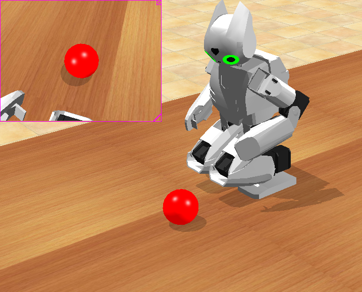

## Visual tracking

This example illustrates the use of the camera (including the
[Vision Manager](vision-manager.md)) and the use of the RGB LEDs.

%figure "Visual tracking example"



%end

In the infinite loop the [Vision Manager](vision-manager.md) is used to find the red ball. Then, if
the ball has been found the head led is set to green and otherwise to red. Then,
again, if the ball has been found the position of the two motors of the head is
corrected to watch in the direction of the ball. To move the ball in simulation,
press Ctrl+Shift and move the ball with the left button of the mouse pressed on
it.

Try to change the color of the LED by changing this line:

```c++
mHeadLED->set(0xFF0000);
```

>**Note**: Here the color is set in hexadecimal. The format is R8G8B8: The most significant
8 bits (left hand side) indicate the red level (between 0x00 and 0xFF). Bits 8
to 15 indicate the green level and the least significant 8 bits (right hand
side) indicate the blue level. For example, 0xFF0000 is red, 0x00FF00 is green,
0x0000FF is blue, 0xFFFF00 is yellow, etc.

Try also to use the other RGB LED, this is done simply be exchanging `mHeadLED`
by `mEyeLED`.

Here again this example is well suited for remote compilation. You can adjust the
color of the ball by changing the value in the constructor of
`RobotisOp2VisionManager` if your ball has a different color.

This example can also be used as a tool to tune the parameters of the
[Vision Manager](vision-manager.md) in order to fit your application.
