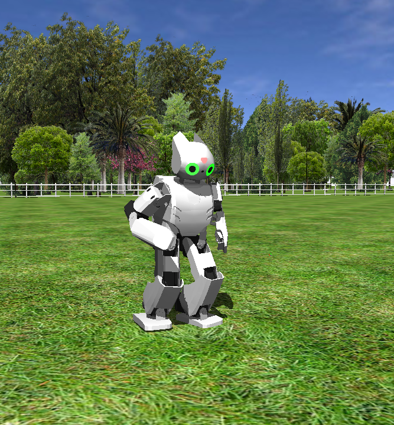

## Walk

This example illustrates the use of the [Gait Manager](gait-manager.md) and [Motion manager](motion-manager.md), the use of the keyboard, and also the use of the accelerometer.

%figure "Walk example"

%end

At the beginning of the controller, the [Motion manager](motion-manager.md) is used to make the robot stand up, then the controller enters an infinite loop:
- The first thing done in the loop is to check if the robot has not fallen down,
this is achieved by using the accelerometer.
- Then if the robot has fallen down, the [Motion manager](motion-manager.md) is used
to make the robot to stand up.
- Then, the keyboard is read, if the space bar is pressed the robot start/stop
to walk.
- Then, the keys up/down/right/left are pressed to make the robot turn
and move forward/backward, several keys can be pressed at the same time.

Try to add some more actions by using more keys.
You can for example use the `NUMPAD_RIGHT` and `NUMPAD_LEFT` keys to make a right/left shoot (page ids 12 and 13 in [Motion manager](motion-manager.md)).
You can also use normal keys like 'A' instead if you prefer.

You can also use another key to make the robot walk quicker or slower.
Change the XAmplitude sent to the [Gait Manager](gait-manager.md), values must be between -1 and 1.

This example works in remote compilation but you will need to connect a USB keyboard to the robot.
Otherwise, it is recommended to test this example with the remote control in order to use the computer's keyboard instead.

This example can also be used to explore and test all the parameters of the gait.
